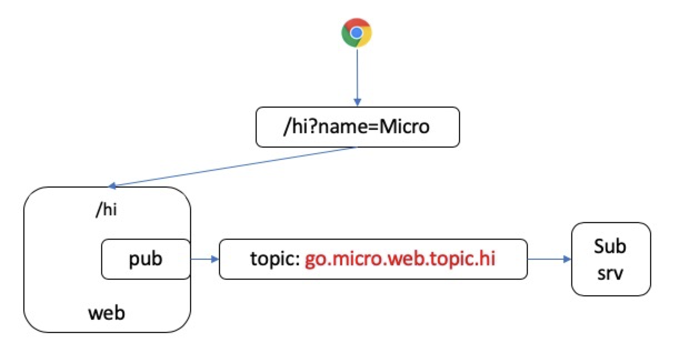

# web与pub结合

本示例演示go-web与pub service结合

我们定义两个服务：

- go.micro.book.web.pub 发布服务，负责接收web请求，与下发pub消息
- go.micro.book.web.sub 订阅服务，负责接收go.micro.book.web.pub下发的消息

它们架构如下：

当http向请求**/hi**路由请求时，web服务接收并处理请求，随后pub消息，此时Sub服务便能收到并处理消息。