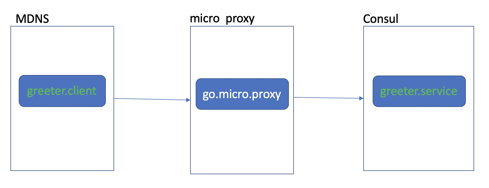

# Micro Proxy

**micro proxy**的作用是提供访问Go-Micro服务代理，它与**Micro API**不一样的地方在于，API将Go-Micro服务暴露为Http接口，而Proxy的职责则是为不同网络之间访问Go-Micro服务提供入口。

## 其它示例

[gRPC+Node+Proxy](./grpc/node)

## 代理Go-Micro服务

我们使用两种不同的注册机制来模拟不同的服务集群，客户端我们使用MDNS注册，而服务端我们使用Consul注册，这样，两个服务集群之间就是不通的，因为彼此不在一样注册服务下，便不知道对方的地址。为了简化，我们也只在两个集群之中各建立一个服务，见下图：



我们假设您已经启动Consul并默认为本地启动。

### 启动服务

1. 启动Micro Proxy

```bash
micro --registry=consul proxy
```

2. 注册在Consul集群的服务：

```bash
cd ./consul
go run server.go --registry=consul
```

3. 启动注册在MDNS集群的客户端

```bash
cd mdns
MICRO_PROXY_ADDRESS=localhost:8081 go run client.go
```

我们需要告诉客户端通过Proxy代理请求服务，因此，需要声明Proxy：`MICRO_PROXY_ADDRESS=localhost:8081`。8081是Proxy的默认端口，可以通过`--address=:9090`修改。

随后我们可以看到客户端打印了响应结果：

```bash
你好，Micro中国
```

## 代理其它类型的服务

**Micro Proxy**目前提供三种协议的代理：mucp(默认)、grpc、http。它们能代理各自类型的Micro服务。

1. GRPC

```bash
micro --registry=consul proxy --protocol=grpc
```

通过指定`--protocol=grpc`修改。

## 集群

我们上面的用法是需要调用方声明具体的地址来找到Proxy的，如果我们的Proxy是集群，那要如何处理呢？coming soon
