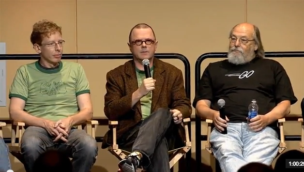

# Golang的发展历史

> Go是一个开源的编程语言,它很容易用于构建简单、可靠和高效的软件。

关于Golang的出身，不得不从信息学领域的紫禁之巅-贝尔实验室（Bell Labs）说起。我们将时光机拨到上世级60年代末，Dennis Ritchie与Ken Thompson携手共同开发出了IT界无人不晓的操作系统Unix。在Unix被开发出来之前，二位前辈还创造了B语言，随后并用B编写了早期的Unix。

在第4版本的Unix出生之前，1972到1973两年间Dennis Ritchie开发出了C语言，并用其重新实现了Unix内核。说起Unix，这个系统影响了所有后来的商业与民用计算机操作系统，各种Linux发布版本redHat、Ubuntu、CentOS等等，以及FreeBSD系列、Mac OSX等等，而Unix的设计理念或多或少也影响了Windows及其产品线IIS等。

在Go出生之前，80年代，贝尔实验室开发了一款专门用于解决分布式运算的语言Limbo，并用其开发出了Plan 9系统的分支Inferno，其中的作者就有Rob Pike、Ken Thompson、Dennis Ritchie。

90年代，贝尔实验室在商业动荡中风雨飘摇。也许是为了生计与情怀，很多人选择加入了其他公司，其中Plan 9团队主要成员选择加入了Google。

在Google，Go语言由Ken Thompson, Rob Pike和Robert Griesemer三位大牛于2007年9月开始设计和实现：

Robert Griesemer，Rob Pike，Ken Thompson

我们简单介绍下这三位主要作者。

- Robert Griesemer（罗伯特·格里泽默）：曾设计了Chrome浏览器的JavaScript V8引擎，协助制作Java的HotSpot编译器。
- Rob Pike（罗布·派克）： Unix小组成员，参与Plan 9、Inferno操作系统研发，UTF-8编码的创立者之一。
- Ken Thompson（肯·汤普逊）： 设计了B语言、C语言，创建了Unix和Plan 9操作系统，UTF-8的主要设计者，1983年图灵奖得主。

比较遗憾的是，Unix与C语言的三大教父Rob Pike、Ken Thompson、Dennis Ritchie并没有一起再续前缘，携手开发Golang。Dennis Ritchie，于2011年去世，不过他所设计的B、C、Limbo语言，深深影响Golang。

重要事件时间轴：

2007年9月21 日起Go语言项目成为Google公司20%兼职项目，即相关员工利用20%的空余时间来参与Go语言的研发。

2009年的11月 Go语言正式对外正式发布。Golang社区非常活跃，发布当年就当选了 TIOBE 年度语言。

2010年5月 Google公司开始将Go语言投入到自家后端基础设施的实际开发中。

2011年4月 Google开始抽调员工全职开发Go语言项目。 

2012年3月 Go语言正式发布1.0版本。

2013-2019 每年发布两次发布升级版本，1.1-1.12。

Go语言借助开源社区的力量快速发展，吸引了众多开发者来使用并改善它。自发布以来，已有超过 1000 名贡献者，超过 40000 次提交。有许多公司在项目早期就开始使用Go语言进行开发，尤其是一些初创公司。在这些公司当中，有的现已成为云计算领域中的巨头。其中一家创业公司，现在叫 Docker，就是使用 Go 进行项目开发，并促进了计算机领域的容器行业发展，进而又出现了像 Kubernetes 这样的火爆项目。除此之外，使用Go语言开发的有名项目还有etcd、consul、flannel、Docker Swarm等等。

在国内，今日头条、UBER、知乎等公司，他们都在使用GO语言对自己的业务进行了彻底的重构。Go语言是21世纪的C语言，也是云计算时代的C语言，未来有着无限可能！

## 参考阅读

[贝尔实验室](https://en.wikipedia.org/wiki/Bell_Labs)
[B语言](https://en.wikipedia.org/wiki/B_(programming_language))
[plan 9](https://en.wikipedia.org/wiki/Plan_9_from_Bell_Labs)