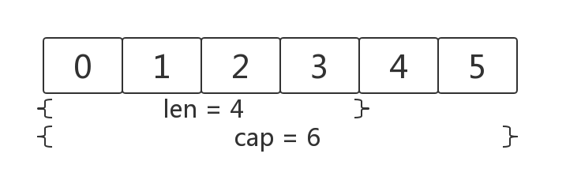

# 基本数据类型和要素

## 关键字

Go（1.12）提供了25个关键字，它们分别是：

- 流程控制类：break，case，continue，default，else，fallthrough，for，goto，if，range，return，select，switch
- 流程控制类（特殊，改变函数调用行为）：defer，go
- 程序元素声明类：const，func，import，package，type，var
- 程序结构声明类：chan，interface，map，struct

相比与Java（55个）、C（32个）等高级开发语言还是精简不少

## 包的概念

类似其他语言中的库和模块的概念，目的都是为了支持模块化、封装、单独编译和代码重用。每一个 Go 文件都属于且仅属于一个包，每个包可以有多个 Go 文件。每个包中的程序可以使用自身的包或者导入其他包。

当包内的全局变量或者常量标识符以一个大写字母开头，如： Test，那么它就是可以直接被外部包使用的，称为导出，类似于其他面向对象语言中 public。如果是以小写的字母开头，则对包外是不可见的，但是可以在包内直接使用（同一个包内的不同 .go 文件可以直接使用），类似于其他面向对象语言中的 private。

每个包都对应一个独立的名称空间。不同包的导出函数或者变量即使名称相同，也不会有命名冲突。在外部调用时必须显示指定包，例如： fmt.Println 。如果包名有冲突，可以在导入的时候设置别名，如：

```go
package main

import f "fmt"

func main() {
    f.Println("Hello World")
}
```

如果需要导入多个包

```go
import "fmt"
import "os"
```

但是有更简短的做法

```go
import (
   "fmt"
   "os"
)
```

## 注释

Go 提供了 C 样式 /* */ 块注释和 C++ 样式 // 行注释。行注释是标准规范，块注释主要作为包注释出现或者是禁用大量代码时使用。

```go
// 单行注释

/*
   块注释
*/
```

## 常量

Go 的常量使用 const 关键字定义，常量的数据类型只可以是布尔型、数字型和字符串类型。

```go
const a string = "abc"
const b = "abc"
```

Go 的编译器可以自动推断类型，所以以上两种定义方法都是可以的。

常量的值必须是能够在编译期就能够确定的，可以在其赋值表达式中涉及计算过程，但是所有用于计算的值必须在编译期间就能获得。

```go
const c = 1+3
```

上面是正确的做法，但是下面的 func1 自定义函数无法在编译期求值，因此无法用于常量的赋值，但是 Go 内置的函数是可以的，如： len() 。

```go
const c = func1()
```

Go 对关键字十分吝啬，对于枚举类型没有专门的关键字，但是常量可以用作枚举。

```go
const (
    a = 0
    b = 1
    c = 2
)
```

Go 语言还提供了 iota 关键字，可以用来简化常量的增长数字的定义。iota 会自增 1 ,每遇到一次 const 关键字，就重置为 0 。

```go
const (
    a = iota  //0
	b         //1
	c         //2
)
```

## 变量

Go 声明变量使用 var 关键字：

```go
var a int = 1
```

```go
var (
	a int    // 0
	b bool   // false
	c string // ""
    d *int   // nil
)
```

声明变量时可以不赋值，默认初始化都会是 ”零“ 值，不会出现 C/C++ 那样的随机值。

Go 的编译器同样可以根据变量的值来自动推断其类型：

```go
var a = 12
```

Go 还提供简短声明语法 := ，不过只可以用于声明函数体内的局部变量，不能用在全局变量的声明与赋值，例如：

```go
a := 1   //等价于 var a = 1
```

需要注意的是 := 是声明并初始化，所以 := 左边必须是一个新值，否则会出现编译错误。

## 基本类型和运算符

### 布尔类型

```go
var a bool = true
```

布尔类型的值只可以是 true 或者 false ，两个类型相同的值可以使用 == 和 != 运算符来比较并且得到一个布尔类型的值。Go 是一门强类型的语言，所以必须是相同类型的两个值才可以进行比较。如果是一个字面量和一个值比较，值的类型必须和字面量类型兼容。

```go
var a = 10

if a == 1 {    // 可以

}

if a == 3.5 {  // 编译报错

}
```

### 数字类型

Go 支持整型、浮点型数字和复数类型。

#### 整形

- int int8 int16 int32 int64
- uint uint8 uint16 uint32 uint64

int 和 uint 在 32 位系统上是 32 位（4个字节），在64位操作系统上是 64 位（8个字节）。其他如 int8 这种都是与系统无关的类型，有固定的大小，从类型的名称就可以看出其大小。

#### 浮点型

- float32
- float64

float32 精确到小数点后 7 位，float64 精确到小数点后 15 位。应该尽可能地使用 float64，因为 math 包中所有有关数学运算的函数都会要求接收这个类型。

#### 复数

Go 提供以下复数类型：

- complex64
- complex128

复数使用 re+imI 来表示，其中 re 代表实数部分，im 代表虚数部分，I 代表根号负 1 。

```go
var c complex64 = 5 + 10i
```

内置的 complex 函数用于构建复数,内建的 real 和 imag 函数分别返回复数的实部和虚部。

```go
var	x complex128 = complex(1, 2)	// 1+2i
var	y complex128 = complex(3, 4)    // 3+4i
fmt.Println(x*y)                    // "(-5+10i)"
fmt.Println(real(x*y))              // "-5"
fmt.Println(imag(x*y))              // "10"
```

### 字符类型

Go 中字符类型 byte 只是整数的特殊用例，byte 类型是 uint8 的别名。

```go
var ch1 byte = 'a'
var ch2 byte = 65
```

### 关系运算符

Go 中拥有以下逻辑运算符，和其他语言的用法相同，运算结果总是为布尔值。

- !=  、 ==
- <  、 <=  、 >  、 >=
- && 、 ||

### 逻辑运算符

&& 、 || 逻辑与和逻辑或同样支持短路法则。

### 算术运算符

Go 提供常用的整数和浮点数的二元运算符： + 、 - 、* 、/ 。

```go
var a = 5 / 2  // 2
var b = 5 % 2  // 1
```

对于语句  a = a + 2 ，同样提供  -= 、 *= 、 /= 、 %=  运算符来简化写法。

```go
var a = 1
a = a + 2
a += 3
```

++ 、 -- 一元操作符在 Go 中只能用于后缀，并且只能作为语句而非表达式。

```go
i++       // 正确
++i       // 编译报错，不能用于前缀

a = i++   // 编译报错，不能作为表达式
```

## 字符串

Go 语言的字符串是一个以UTF8编码的字节序列，并且一旦创建就无法更改。无法像 C/C++ 那样通过索引改变字符串中的某个字符（取字符串某个字节的地址也是非法的 &str[i] ），并且 Go 中的字符串是根据长度限定，不是特殊字符 \0 。

```go
var str string
```

Go 语言的字符串如果声明时未初始化，则默认是 ”零“ 值，即空串 "" ，长度为0

```go
str := "Hello " + "World"
str += " ! "
```

字符串可以通过 **+** 号拼接，也可以使用 **+=** 简写形式。

## 数组

数组是一个有固定长度的且类型唯一的数据序列，

```go
var arr [4]int
fmt.Println(a[0])           // 打印第一个元素  0
fmt.Println(a[len(a)-1])    // 打印最后一个元素 0
```

同样，数组的每个元素都被初始化为元素类型对应的 ”零“ 值，在此处是 0 。

```go
var	a [3]int = [3]int{1, 2, 3}
b := [...]int{ 1, 2, 3}
```

可以在声明数组时给定一组值来初始化数组，在数组长度位置用 "..." 三个点来替代，代表数组的长度根据具体数值的个数来计算。

把一个大数组通过函数传参会消耗大量内存，因为 Go 语言都是值传递，会将数组完整的拷贝一份。可以通过两种方法在避免：

- 传递数组的指针
- 使用切片

## 切片(slice)

切片是一个长度可变的数组，类似 C++ 的动态数组（vector）。切片的语法和数组很像，只是切片没有限定固定长度。

```go
var a []int    // 切片
var b [3]int   // 数组
```

一个切片底层由三部分组成：指针、长度、容量。指针指向切片的第一个元素的地址，长度对应切片中元素的数量，容量是切片底层分配的连续内存空间可容纳元素的数量。切片提供 cap() 函数来计算其容量， len() 函数来计算其长度。



```go
s := []int{0, 1, 2, 3, 4, 5}
fmt.Println(s[:2])  // [0 1]
fmt.Println(s[2:])  // [2 3 4 5]
fmt.Println(s)      // [0 1 2 3 4 5]
```

一个 ”零“ 值的切片是nil，长度和容量都为0。

```go
var s []int     // len(s) == 0, s == nil
s = nil         // len(s) == 0, s == nil
s = []int(nil)  // len(s) == 0, s == nil
s = []int{}     // len(s) == 0, s !=nil
```

我们可以通过 **make** 函数创建以一个指定元素类型、长度和容量的切片。容量参数可以不传，Go 会按照指定的长度和类型初始化。

```go
// make([]T, len, cap)
make([]int, 3)      // [0,0,0]
make([]int, 3, 5)  // [0,0,0, *, *]
```

Go 内置的 append 函数可以向切片追加元素。

```go
var s []int
s = append(s, 2)
```

append 函数底层在每次操作之前都会先检查切片的容量，如果容量够，就会直接将新添加的元素复制到对应位置并将长度加1;如果容量不够，会先分配一个足够大的内存空间，然后将原来的切片内容和新添加的全部复制过去，再返回这个切片。

## Map

Map 是一个无序的 key/value 的集合，类似于其他编程语言中的字典，哈希表。Map 和 切片一样在使用过程会自动扩容。

```go
var m map[string]int
v := make(map[string]int)
v1 := make(map[string]int, 10)  // 初始化容量为 10
a := map[string]int{
				"abc": 1,
				"def": 2,
                }

m["test"] = 1           // 错误， 此时 m 是 nil
fmt.Println(a["abc"])
delete(a,"abc")

```

Map 可以使用 make 函数创建（可以选择在创建时指定容量），也可以通过map字面值的语法创建，同时还可以指定一些最初的 key/value。需要注意的是，未初始化的 map 的值是 nil，直接访问会出错。Map 中的元素通过key对应的下标语法访问。使用内置的delete函数可以删除元素。

key对应的下标语法访问时，通过如果key在map中是存在的,那么将得到与key对应的value。如果key不存在,那么将得到value对应类型的零值。但是元素类型为 int，就无法区分 0 了。为此，Go 提供了两个返回值来区分。

```go
v, ok := a["test"]
if	!ok	{

}
```

当 ok 为 false 时表示 Map 中找不到 key 等于 "test" 对应的元素。

## 结构体

结构体是一种聚合的数据类型,是由零个或多个任意类型的值聚合成的实体。结构体定义的一般方式如下：

```go
// type identifier struct {
//     field1 type1
//     field2 type2
//     ...
// }

type Abc struct {
    A int
    B int
    C int
}

var s Abc
s.A = 1
s.B =2
```

使用内置的 new 函数可以给一个新的结构体变量分配内存，它返回指向已分配内存的指针。Go 中使用点符号获取结构体中的值：structname.fieldname = value 。实际上，在 Go 中无论是值类型还是指针类型都使用点符号，并没有 C/C++ 中的 -> 符号。

```go
var t *Abc
t = new(Abc)

t2 := new(Abc)

t.A = 2
t2.B = 3
```

结构体初始化主要有两种方法，一种是按照结构体成员定义的顺序为每个成员指定一个面值，这样如果结构体成员顺序又调整就需要改动所有初始化结构体的地方了，所以不太建议着一种;另一种就是，以成员名字和对应值来初始化。

```go
type Abc struct {
    A int
    B int
    C int
}

s := Abc{1, 2, 3}
s2 := Abc{
    A : 1,
    B : 2,
    C : 3,
}
```
