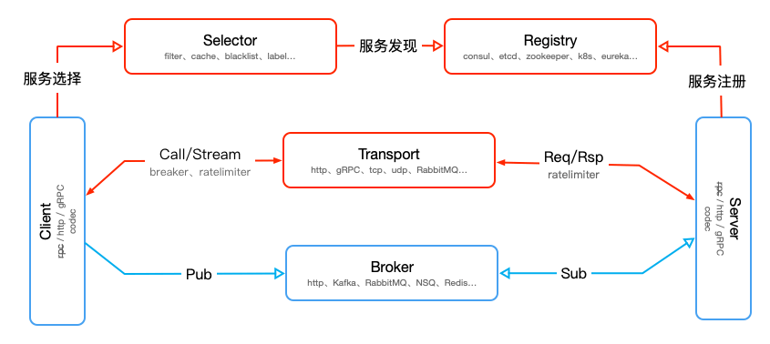

# go-micro服务加入istio服务网格

在`mesh`场景中微服务的`server`及`client`端不需要服务治理相关的组件，而`go-micro`的组件都是插件式的，可以很方便的进行定制，
从上图可以看出只需要定制`server`和`client`插件。

`istio`支持的`http`、`gRPC`在`go-micro`插件中都有实现，只需要在此基础上做下改造便可以适用`mesh`场景，
使用`http`或`gRPC`自然`transport`也不存在，剩下的就是剥离掉`registry`和`selector`。

[plugins](plugins)是改造好的`istio`插件。

- Support
    - [x] HTTP
    - [ ] gRPC
    
> `gRPC`是由于`transport`包变为`internal`需要做版本的升级适配

接下来内容假设大家对[Envoy](https://www.envoyproxy.io)、[Istio](https://istio.io)有一定了解。

- [01.快速开始](01.快速开始.md)