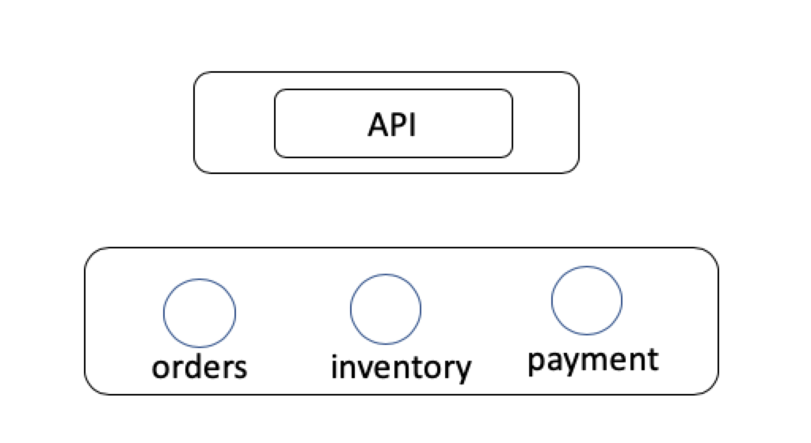

# 分布式同步 in progress

Micro中的模块[Sync](https://github.com/micro/go-micro/tree/master/sync)用于解决分布式锁问题，不过Micro自身并没有完成常见的分布式一致性协议。

理想状态下的分布式系统天生各自独立、解耦。从经验、现有技术与大多数情形上看，分布式系统只能选择[CAP][CAP]原理中的两个字母，要可用性（Availability）与分区容错（Partition tolerance）则会丢掉一致性（Consistency），同样其它两个任意组合一样会丢掉剩下的选项。

而如果微服务自身要去实现CAP组件，则会非常复杂与过重，故而，一般微服务框架都会选择第三方数据库或者事件系统来完成CAP要素要求。Micro利用第三方数据库（目前使用的是Consul）来完成同步机制。

我们用三个服务**Order订单**、**Payment支付服务**、**Inventory库存服务**来演示如何分布式锁。

简单描述下业务场景：当用户下单时，后台需要有扣单、等支付、支付后出库这几个流程，在整套流程链中，每个环节都不能出错。

[业务时序图]

## Micro Sync 组件

-- Leader
-- Lock
-- Task
-- Time

## 参考阅读

[什么是CAP][CAP]

[CAP]:(https://zh.wikipedia.org/wiki/CAP%E5%AE%9A%E7%90%86)