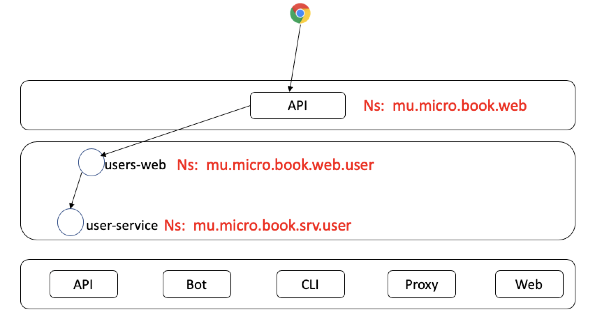
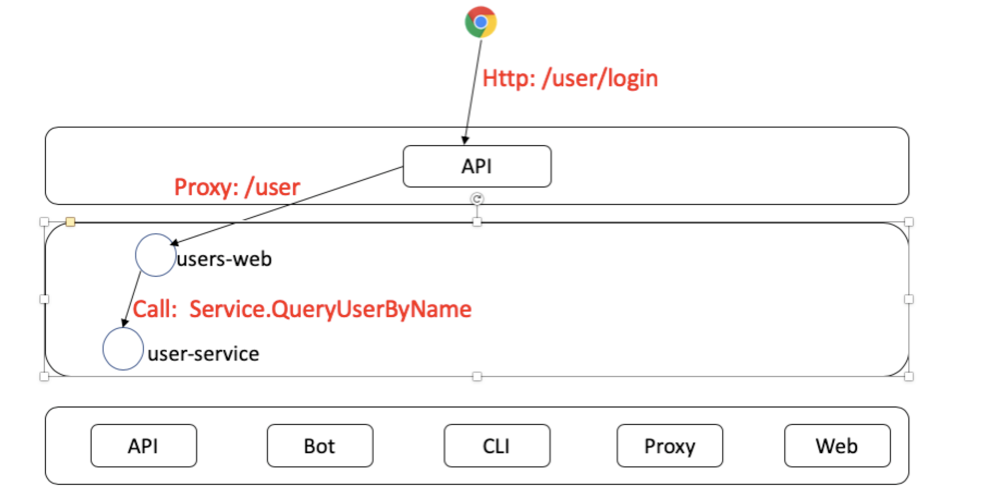
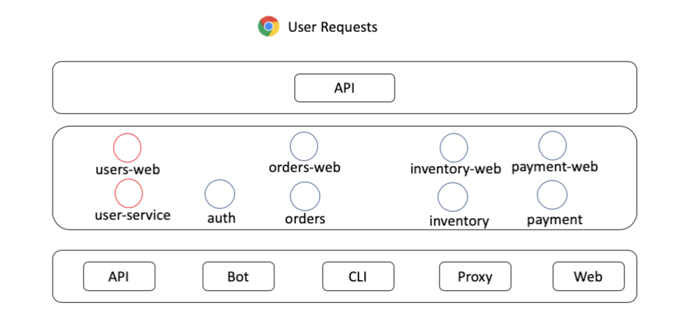

# 第一章 用户服务

本章节我们实现用户服务，用户服务分为两层，web层（user-web）与服务层（user-srv），前者提供http接口，后者向web提供RPC服务。

- user-web 以下简称**web**
- user-srv 以下简称**service**

**web**服务主要向用户提供如下接口

- 登录与token颁发
- 鉴权

我们不提供注册接口，一来增加不必要的代码量，我们的核心还是介绍如何使用Micro组件。

**server**服务主要向所有内部服务提供用户查询接口：

- 根据userName用户名查询用户

由于我们现在才开始第一章，所以我们下面的内容细节处讲解会多一些。后面的章节我们会加快脚步。

在开发应用之前，我们要先定义好命名空间。

|服务|命名空间|说明|---|
|---|---|---|---|
|接入层API|mu.micro.book.web|负责代理所有**mu.micro.book.web**下游的web应用，比如**mu.micro.book.web.user**等|---|
|用户web|mu.micro.book.web.user|接收API下放的路由为/user请求|---|
|用户服务|mu.micro.book.srv.user|对架构内应用提供user查询服务|---|

见下图



## user-srv

我们先从下往上编写，也就是从服务层**user-srv**开始

user-srv的各组件如下表所示

|启动顺序|组件|作用|---|
|---|---|---|---|
|1|basic|初始化配置与解析配置文件，初始化数据库等基础组件|---|
|2|model|模型层，提供业务数据|---|
|3|handler|接入层，提供对外接口，并向model层调用请求数据|---|

Micro有提供代码生成器指令[**new**][micro-new]，它可以新建服务模板代码，把基本所需的目录结构建好，省去大家挖坑的时间。

下面我们使用它来创建用户服务。

- <span style="color:red">*</span>需要有个说明的地方，因为我们现在执行的命令是直接将代码生成到当前的目录，所以大家在自己运行时，请修改到自己的路径，以免覆盖示例程序，引起不必要的麻烦。

好，我们开始

### 新建模板

```bash
micro new --namespace=mu.micro.book --type=srv --alias=user github.com/micro-in-cn/tutorials/microservice-in-micro/part1/user-srv
```

我们解释一下各个flag参数

- namespace，因为我们要让**web**直接暴露在API之下，而本篇后面我们会开一个handler模式为web的API，它的命名空间为`mu.micro.book.web`，故而，我们服务

模板生成在**user-srv**目录，其结构如下

```text
.
├── main.go
├── plugin.go
├── handler
│   └── example.go
├── subscriber
│   └── example.go
├── proto/example
│   └── example.proto
├── Dockerfile
├── Makefile
└── README.md

```

### 定义User原型

我们需要在service.proto中定义User原型，暂且定义以下字段，足够登录，显示用户基本信息、异常信息即可;

```proto
syntax = "proto3";

package mu.micro.book.srv.user;

service User {
    rpc QueryUserByName (Request) returns (Response) {
    }
}

message user {
    int64 id = 1;
    string name = 2;
    string pwd = 3;
    uint64 createdTime = 4;
    uint64 updatedTime = 5;
}

message Error {
    int32 code = 1;
    string detail = 2;
}

message Request {
    string userID = 1;
    string userName = 2;
    string userPwd = 3;
}

message Response {
    bool success = 1;
    Error error = 2;
    user user = 3;
}
```

上面我们定义了User服务的基本原型结构，包含用户**User**，请求**Request**与响应结构**Response**，还定义了查询用户的方法**QueryUserByName**。

下面我们生成类型与服务方法：

```bash
protoc --proto_path=. --go_out=. --micro_out=. proto/user/user.proto
```

```go
package main

// ...

func main() {
    // New Service
    service := micro.NewService(
        micro.Name("mu.micro.book.srv.user"),
        micro.Version("latest"),
    )

    // Initialise service
    service.Init()

    // Register Handler
    s.RegisterUserHandler(service.Server(), new(handler.Service))

    // Register Struct as Subscriber
    micro.RegisterSubscriber("mu.micro.book.srv.user", service.Server(), new(subscriber.Service))

    // Register Function as Subscriber
    micro.RegisterSubscriber("mu.micro.book.srv.user", service.Server(), subscriber.Service)

    // Run service
    if err := service.Run(); err != nil {
        log.Fatal(err)
    }
}

```

生成的**main**方法比较简单，根据我们当前的需要，我们把不要的pubsub（发布订阅）都删掉，变成：

```go
package main

// ...

func main() {
    // New Service   新建服务
    service := micro.NewService(
        micro.Name("mu.micro.book.srv.user"),
        micro.Version("latest"),
    )

    // Initialise service  初始化服务
    service.Init()

    // Register Handler   注册服务
    s.RegisterUserHandler(service.Server(), new(handler.Service))

    // Run service    启动服务
    if err := service.Run(); err != nil {
        log.Fatal(err)
    }
}

```

朋友们可能已经发现，如果我们要从数据库里获取数据，模块提供的代码是远远不够的，那下面我们就真正开始编写代码。

### 开始写代码

上面的生成的目录部分，我们需要手动改一下：

生成的部分代码我们用不到，把它们删掉，加上我们需要的文件与目录。结构如下

```text
.
├── main.go
├── plugin.go
├── basic
│   └── config               * 配置类
│   │   └── config.go        * 初始化配置类
│   │   └── consul.go * consul配置结构体
│   │   └── mysql.go  * mysql配置结构体
│   │   └── profiles.go      * 配置文件树辅助类
│   └── db                   * 数据库相关
│   │    └── db.go           * 初始化数据库
│   │    └── mysql.go        * mysql数据库相关
│   └── basic                * 初始化基础组件
├── conf                     * 配置文件目录
├── handler
│   └── user.go              * 将名称改为user
├── model                    * 增加模型层，用于与数据库交换数据
│   └── user                 * 用户模型类
│   │   └── user.go          * 初始化用户模型类
│   │   └── user_get.go      * 封装获取用户数据类业务
│   └── model.go             * 初始化模型层
├── proto/user    
│   └── user.proto           * 将名称改为user
├── Dockerfile
├── Makefile
└── README.md
```

其中加`*`的便是我们修改过的结构，其后跟的描述是目录或文件的功能或作用。可能大家会觉得改动这么大，模板命令还有什么用呢？

其实模板只是生成基础目录，把大家引进一个风格的项目中，这样管理起来会轻松许多。下面我们解释一下为什么要新增两个目录：**basic**，**model**和**config**。

**basic**和**model**其实和Micro无关，只是为了满足我们为**user-srv**的业务定位，它是一个**MVC**应用后台，而C交给了**user-web**，其中的**M**才是它的主要功能。

- **basic** 负责初始化基础组件，比如数据库、配置等

- **model** 负责封装业务逻辑

- **conf** 配置文件目录，现在我们还没用配置中心，暂先用文件的方式

有朋友会问，那**handler**目录呢？刚说**user-srv**本质上是一个MVC应用的后台，它弱化了C成handler，只负责接收请求，不改动业务数据**值**，但可能改动结构以便回传。

下面我们开始处理业务方面的东西

### 创建User表

我们选用Mysql作为数据库，以下是建表语句，完整sql可以在[文档](./docs/schema.sql)目录找到：

```sql
CREATE TABLE `user`
(
    `id`           int(10) unsigned                                              NOT NULL AUTO_INCREMENT COMMENT '主键',
    `user_id`      int(10) unsigned                                                       DEFAULT NULL COMMENT '用户id',
    `user_name`    varchar(20) CHARACTER SET utf8mb4 COLLATE utf8mb4_0900_ai_ci  NOT NULL COMMENT '用户名',
    `pwd`          varchar(128) CHARACTER SET utf8mb4 COLLATE utf8mb4_0900_ai_ci NOT NULL COMMENT '密码',
    `created_time` timestamp(3)                                                  NOT NULL DEFAULT CURRENT_TIMESTAMP(3),
    `updated_time` timestamp(3)                                                  NOT NULL DEFAULT CURRENT_TIMESTAMP(3) ON UPDATE CURRENT_TIMESTAMP(3),
    PRIMARY KEY (`id`),
    UNIQUE KEY `user_user_name_uindex` (`user_name`),
    UNIQUE KEY `user_user_id_uindex` (`user_id`)
) ENGINE = InnoDB
  DEFAULT CHARSET = utf8mb4
  COLLATE = utf8mb4_bin COMMENT ='用户表';
```


预置一条数据，*为了简化，我们的账户密码暂时使用明文*，后面的章节会加盐hash后再存储、匹配。

```sql
INSERT INTO user (user_id, user_name, pwd) VALUE (10001, 'micro', '123');
```

### 基础组件

[基础组件](./user-srv/basic)目前主要的功能是初始化配置与数据库。它的入口代码是一个**Init**初始化方法，负责初始化其下所有组件。

```go
package basic

import (
    "github.com/micro-in-cn/tutorials/microservice-in-micro/part1/user-srv/basic/config"
    "github.com/micro-in-cn/tutorials/microservice-in-micro/part1/user-srv/basic/db"
)

func Init() {
    config.Init()
    db.Init()
}
```

### 配置

加载配置我们会使用到[go-config](https://github.com/micro/go-micro/config)里面的本地文件配置。相关示例可以参考[go-config示例](https://github.com/micro-in-cn/all-in-one/tree/master/basic-practices/micro-config)。

我们先看下根配置文件[application.yml](./user-srv/conf/application.yml)的样子

```yaml
app:
  profiles:
    include: consul, db
```

起名为**application.yml**是参考了Spring-boot风格，我觉得这个设计非常漂亮，于是在这抄袭一番。我们把consul和db配置分到独立的文件中

通过解析`app.profiles.include`来加载指定的配置文件。当然也可以全部写在**application.yml**中，只是我觉得挤在一起的配置不优雅。

然后再将初始化配置的过程大致如下：

|顺序|过程|说明|
|---|---|---|
|1|加载application.yml|读取conf目录下application.yml文件|
|2|解析profiles属性|如果有该属性则找到include值，该值就是指定需要引入的conf下的配置文件|
|3|解析include|解析出include配置【值】，并组合成文件名，文件名规则为[application-值.yml]|
|4|读取include声明文件|读取配置文件值|
|5|解析配置|将配置文件中的值解析到配置对象中|

下面是它的核心代码

```go
// InitConfig 初始化配置
func InitConfig() {

    m.Lock()
    defer m.Unlock()

    if inited {
        log.Logf(fmt.Errorf("[InitConfig] 配置已经初始化过"))
        return
    }

    // 加载yml配置
    // 先加载基础配置
    appPath, _ := filepath.Abs(filepath.Dir(filepath.Join("./", string(filepath.Separator))))

    pt := filepath.Join(appPath, "conf")
    os.Chdir(appPath)

    // 找到application.yml文件
    if err = config.Load(file.NewSource(file.WithPath(pt + "/application.yml"))); err != nil {
        panic(err)
    }

    // 找到需要引入的新配置文件
    if err = config.Get(defaultRootPath, "profiles").Scan(&profiles); err != nil {
        panic(err)
    }

    log.Logf("[InitConfig] 加载配置文件：path: %s, %+v\n", pt+"/application.yml", profiles)

    // 开始导入新文件
    if len(profiles.GetInclude()) > 0 {
        include := strings.Split(profiles.GetInclude(), ",")

        sources := make([]source.Source, len(include))
        for i := 0; i < len(include); i++ {
            filePath := pt + string(filepath.Separator) + defaultConfigFilePrefix + strings.TrimSpace(include[i]) + ".yml"
            fmt.Printf(filePath + "\n")
            sources[i] = file.NewSource(file.WithPath(filePath))
        }

        // 加载include的文件
        if err = config.Load(sources...); err != nil {
            panic(err)
        }
    }

    // 赋值
    config.Get(defaultRootPath, "consul").Scan(&consulConfig)
    config.Get(defaultRootPath, "mysql").Scan(&mysqlConfig)

    // 标记已经初始化
    inited = true
}
```

我们目前定义了三个配置结构，它们在basic的[config](user-srv/basic/config)目录下

- [profiles](./user-srv/basic/config/profiles.go)
- [consul](./user-srv/basic/config/consul.go)
- [mysql](./user-srv/basic/config/mysql.go)：

```go
// defaultProfiles 属性配置文件
type defaultProfiles struct {
    Include string `json:"include"`
}

// defaultConsulConfig 默认consul 配置
type defaultConsulConfig struct {
    Enabled bool   `json:"enabled"`
    Host    string `json:"host"`
    Port    int    `json:"port"`
}

// defaultMysqlConfig mysql 配置
type defaultMysqlConfig struct {
    URL               string `json:"url"`
    Enable            bool   `json:"enabled"`
    MaxIdleConnection int    `json:"maxIdleConnection"`
    MaxOpenConnection int    `json:"maxOpenConnection"`
}
```

### 数据库初始化

数据库的初始化动作在[db.go](user-srv/basic/db/db.go)目录下，下面是初始化方法入口：

```go
package db

// ***

var (
    inited  bool
    mysqlDB *sql.DB
    m       sync.RWMutex
)

// Init 初始化数据库
func Init() {
    m.Lock()
    defer m.Unlock()

    var err error

    if inited {
        err = fmt.Errorf("[Init] db 已经初始化过")
        log.Logf(err)
        return
    }

    // 如果配置声明使用mysql
    if config.GetMysqlConfig().GetEnabled() {
        initMysql()
    }

    inited = true
}

// GetDB 获取db
func GetDB() *sql.DB {
    return mysqlDB
}

```

从代码中可以看到，在判断配置文件中有激活Mysql指令**GetEnabled**时才会去加载数据库。

[mysql.go](user-srv/basic/db/mysql.go)中的初始化代码：

```go
func initMysql() {

    var err error

    // 创建连接
    mysqlDB, err = sql.Open("mysql", config.GetMysqlConfig().GetURL())
    if err != nil {
        log.Fatal(err)
        panic(err)
    }

    // 最大连接数
    mysqlDB.SetMaxOpenConns(config.GetMysqlConfig().GetMaxOpenConnection())

    // 最大闲置数
    mysqlDB.SetMaxIdleConns(config.GetMysqlConfig().GetMaxIdleConnection())

    // 激活链接
    if err = mysqlDB.Ping(); err != nil {
        log.Fatal(err)
        panic(err)
    }
}

```

好，我们把基础的配置与数据库加载完成，现在开始编写业务服务代码。

### 用户模型服务

用户模型服务很简单，就是像数据库获取用户信息被返回给调用者

下面用户模型服务类定义及初始化[user.go](./user-srv/model/user/user.go)

user.go

```go
package user

// ...

var (
    s *service
    m sync.RWMutex
)

// service 服务
type service struct {
}

// Service 用户服务类
type Service interface {
    // QueryUserByName 根据用户名获取用户
    QueryUserByName(userName string) (ret *proto.User, err error)
}

// GetService 获取服务类
func GetService() (Service, error) {
    if s == nil {
        return nil, fmt.Errorf("[GetService] GetService 未初始化")
    }
    return s, nil
}

// Init 初始化用户服务层
func Init() {
    m.Lock()
    defer m.Unlock()

    if s != nil {
        return
    }

    s = &service{}
}
```

1. 其定义了接口*Service*，声明其能力*GetService*。
2. **service**结构继承*Service*提供服务。
3. userService向[model.go](./user-srv/model/model.go)暴露初始化方法**Init**

- model.go

```go
package model

// ...

// Init 初始化模型层
func Init() {
    user.Init()
}
```

现在我们有了服务模型层的结构，开始实现从数据库里获取数据，具体逻辑写在[user_get.go](./user-srv/model/user/user_get.go)里

user_get.go

```go
package user

// ...
func (s *service) QueryUserByName(userName string) (ret *proto.User, err error) {

    queryString := `SELECT user_id, user_name, pwd  FROM user WHERE user_name = ?`

    // 获取数据库
    o := db.GetDB()

    ret = &proto.User{}

    // 查询
    err = o.QueryRow(queryString, userName).Scan(ret.Id, ret.Name, ret.Pwd)
    if err != nil {
        log.Logf("[QueryUserByName] 查询数据失败，err：%s", err)
        return
    }
    return
}

```

查询方法很简单，这里不赘述。

服务类写完之后，我们还差handler与main方法没有完成，下一步我们编写handler处理器[user.go](./user-srv/handler/user.go)，让它来调用model模型层。

**user.go**

```go
type Service struct{}

var (
    userService us.Service
)

// Init 初始化handler
func Init() {

    var err error
    userService, err = us.GetService()
    if err != nil {
        log.Fatal("[Init] 初始化Handler错误")
        return
    }
}

// QueryUserByName 通过参数中的名字返回用户
func (e *Service) QueryUserByName(ctx context.Context, req *s.Request, rsp *s.Response) error {

    user, err := userService.QueryUserByName(req.UserName)
    if err != nil {
        rsp.Success = false
        rsp.Error = &s.Error{
            Code:   500,
            Detail: err.Error(),
        }

        return err
    }

    rsp.User = user
    rsp.Success = true

    return nil
}
```

handler直接调用模型层方法获取数据并回传给rsp结构。

下面把[main.go](./user-srv/main.go)调整一下，然后就可以启动程序了：

```go
package main

// ...

func main() {
   
    // 初始化配置、数据库等信息
    basic.Init()

    // 使用consul注册
    micReg := consul.NewRegistry(registryOptions)

    // New Service
    service := micro.NewService(
        micro.Name("mu.micro.book.srv.user"),
        micro.Registry(micReg),
        micro.Version("latest"),
    )

    // 服务初始化
    service.Init(
        micro.Action(func(c *cli.Context) {
            // 初始化模型层
            model.Init()
            // 初始化handler
            handler.Init()
        }),
    )

    // 注册服务
    s.RegisterUserHandler(service.Server(), new(handler.Service))

    // 启动服务
    if err := service.Run(); err != nil {
        log.Fatal(err)
    }
}

func registryOptions(ops *registry.Options) {
    consulCfg := config.GetConsulConfig()
    ops.Timeout = time.Second * 5
    ops.Addrs = []string{fmt.Sprintf("%s:%d", consulCfg.GetHost(), consulCfg.GetPort())}
}
```

代码中我们默认使用consul作为注册中心，被在Action中初始化基础组件与模型层。

注意，因为handler依赖model，所以初始化handler要在初始化模型层之后执行。

好，程序写完了，下面我们启动它。

```bash
$ go run main.go plugin.go

2019/04/12 23:57:12 [Init] 加载配置文件：path: /Users/me/workspace/go/src/github.com/micro-in-cn/tutorials/microservice-in-micro/part1/user-srv/conf/application.yml, {Include:consul, db}
2019/04/12 23:57:12 [Init] 加载配置文件：path: /Users/me/workspace/go/src/github.com/micro-in-cn/tutorials/microservice-in-micro/part1/user-srv/conf/application-consul.yml
2019/04/12 23:57:12 [Init] 加载配置文件：path: /Users/me/workspace/go/src/github.com/micro-in-cn/tutorials/microservice-in-micro/part1/user-srv/conf/application-db.yml
2019/04/12 23:57:12 Transport [http] Listening on [::]:52801
2019/04/12 23:57:12 Broker [http] Connected to [::]:52802
2019/04/12 23:57:12 Registry [consul] Registering node: mu.micro.book.srv.user-f1cb2a6c-1c8b-4d90-97b6-a9e287c1acc4

```

启动成功，我们调用*Service.QueryUserByName*测试一下服务是否正常:

```bash
$ micro --registry=consul call mu.micro.book.srv.user User.QueryUserByName '{"userName":"micro"}'
{
   "user": {
       "id": 10001,
       "name": "micro",
       "pwd": "1234"
   }
}
```

### 小结

我们初步完成了user-srv的编写。服务具备了向外提供数据交换的能力，它把配置、数据库、模型与接口（handler)统一起来，已经具备微服务的雏形。

有朋友可能会疑问为什么handler->model->db等几个组件都有初始化方法，直接使用[包名.方法名]的方式调用不好吗？

我比较倾向于使用这种服务中重要组件须初始化的方式来设计程序，因为这样让程序调用结构层次封装得更好，各组件如何而来显得清清楚楚。就像Java Bean一样，只是我们显式使用了Init方法。

下面，我们开始编写用户服务的web层**user-web**。

## user-web

**web**服务负责暴露接口给用户，用户请求登录，**web**通过用户名**userName**向**service**获取用户信息，再比对密码，正确则登录成功，反之返回错误。

请求链如下图



相信大家在了解**user-srv**之后，对整个编码过程更熟悉了，所以我们加快步伐。开始写代码。

### 新建模板

因为**web**是web应用，所以我们`--type`flag传入web。

```bash
micro new --namespace=mu.micro.book --type=web --alias=user github.com/micro-in-cn/tutorials/microservice-in-micro/part1/user-web
```

生成的模板目录结构如下

```text
├── main.go     
├── plugin.go
├── handler
│   └── handler.go
├── html
│   └── index.html
├── Dockerfile
├── Makefile
└── README.md

```

go-web是一个很简单的web开发库，它不像其它go语言的web框架有那么多工具集，它核心在两个方面

- 让程序支持http请求
- 天生属于Micro生态

它不需要额外的代码就可以注册到Micro生态中，和其它类型的服务一样。

**web**核心有三个地方

- [config.go](./user-web/basic/config/config.go) 负责加载配置
- [handler.go](./user-web/handler/handler.go) 负责处理请求
- [main.go](./user-web/main.go) 程序运行入口

**config.go**和**service**的[config](#配置)差不多，我们不赘述。

**handler.go**

```go
package handler

// ...

var (
    serviceClient us.Service
)

// Error 错误结构体
type Error struct {
    Code   string `json:"code"`
    Detail string `json:"detail"`
}

func Init() {
    serviceClient = us.NewUserService("mu.micro.book.srv.user", client.DefaultClient)
}

// Login 登录入口
func Login(w http.ResponseWriter, r *http.Request) {

    // 只接受POST请求
    if r.Method != "POST" {
        log.Logf("非法请求")
        http.Error(w, "非法请求", 400)
        return
    }

    r.ParseForm()

    // 调用后台服务
    rsp, err := serviceClient.QueryUserByName(context.TODO(), &us.Request{
        UserName: r.Form.Get("userName"),
    })
    if err != nil {
        http.Error(w, err.Error(), 500)
        return
    }

    // 返回结果
    response := map[string]interface{}{
        "ref": time.Now().UnixNano(),
    }

    if rsp.User.Pwd == r.Form.Get("pwd") {
        response["success"] = rsp.Success

        // 干掉密码返回
        rsp.User.Pwd = ""
        response["data"] = rsp.User

    } else {
        response["success"] = false
        response["error"] = &Error{
            Detail: "密码错误",
        }
    }

    w.Header().Add("Content-Type", "application/json; charset=utf-8")
    
    // 返回JSON结构
    if err := json.NewEncoder(w).Encode(response); err != nil {
        http.Error(w, err.Error(), 500)
        return
    }
}
```

handler里定义了错误结构体**Error**、**Init**、**Login**方法。

- **Init** 用来初始化handler需要用到的服务客户端
- **Login** 处理登录请求

**Login**在解析完参数后，通过RPC调用**service**的**QueryUserByName**方法。查出的结果后再进行密码匹配。

匹配成功后便返回用户信息。我们看下请求结果

运行api

```bash
$ micro --registry=consul --api_namespace=mu.micro.book.web  api --handler=web
```

运行user-srv

```bash
$ cd ../user-srv
$ go run main.go plugin.go 
```

运行user-web

```bash
$ go run main.go
```

请求

```bash
$  curl --request POST   --url http://127.0.0.1:8080/user/login   --header 'Content-Type: application/x-www-form-urlencoded'  --data 'userName=micro&pwd=1234'

# 返回结果

{"data":{"id":10001,"name":"micro"},"ref":1555248603726819000,"success":false}
```

这样，我们把用户发送请求，API接收请求，**web**向**service**查询数据整个调用链都调通了。

## 总结

本章我们实现了处理从客户端到服务链的用户登录请求，给大家演示了从API层到web层再到服务层之间是如何工作的。

我们本章用到的Micro技术点有（依次从文章开始到结束）

- [**micro new**][micro-new-code]，生成Micro风格的模板代码，它是micro项目中的一个子包。
- [**protoc-gen-go**][protoc-gen-go]，隐藏在`protoc ... --micro_out`指令中执行了，感兴趣的同学可以去了解一下。
- [**go-micro**][go-micro]，代码中**micro.NewService**，**service.Init**等都是go-micro中不同类型服务各自实现的方法。
- [**go-config**][go-config]，加载配置时使用。
- [**go-web**][go-web]，编写web应用**user-web**时用到。

至此，我们的服务架构完成度如下：（红圈服务为完成）



但我们工作还不完善：

- 登录后没有session管理，没有生成并返回token。
- **web**和**service**都有basic部分的初始化代码，这部分是可以抽出来公用的。

后面我们会逐一完善。

接下来的下一章，我们会编写权限服务，我们会在这一章实现token生成、颁发、删除、广播等操作。请翻阅，[第二章 权限服务][第二章]。

## 系列文章

- [第二章 权限服务][第二章]
- [第三章 库存服务、订单服务、支付服务与Session管理][第三章]
- [第四章 使用配置中心][第四章]
- [第五章 日志持久化][第五章]
- [第六章 熔断、降级、容错与健康检查][第六章]
- [第七章 链路追踪][第七章] todo
- [第八章 容器化][第八章] todo

## 延伸阅读

[使用Micro模板新建服务][micro-new]

## 讨论

朋友，请加入[slack](http://slack.micro.mu/)，进入**中国区**Channel沟通。

[micro-new]: https://github.com/micro-in-cn/all-in-one/tree/master/middle-practices/micro-new
[protoc-gen-go]: https://github.com/micro/protoc-gen-micro
[micro-new-code]: https://github.com/micro/micro/tree/master/new
[go-micro]: https://github.com/micro/go-micro
[go-config]: https://github.com/micro/go-micro/config
[go-web]: https://github.com/micro/go-web

[第二章]: ../part2
[第三章]: ../part3
[第四章]: ../part4
[第五章]: ../part5
[第六章]: ../part6
[第七章]: ../part7
[第八章]: ../part8
