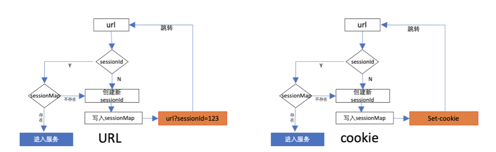
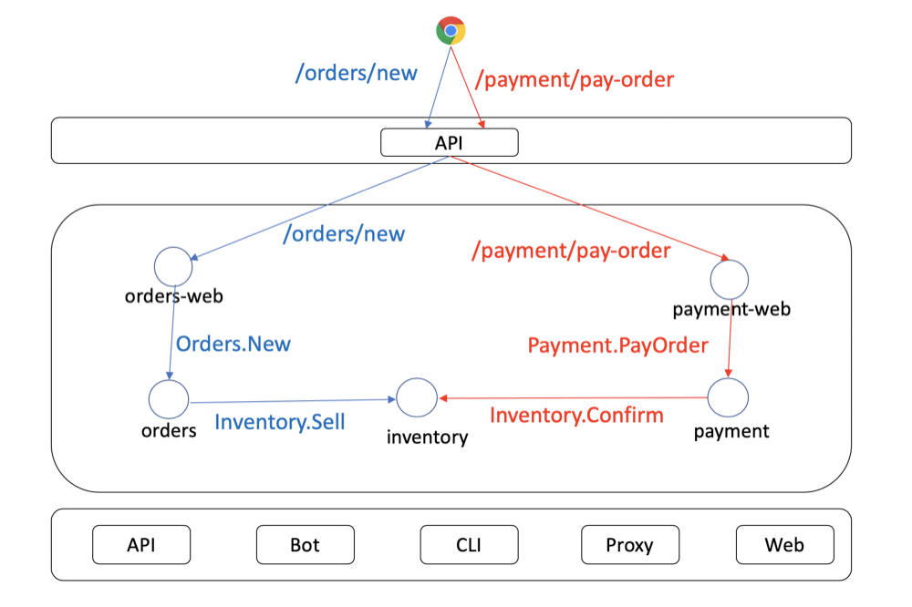
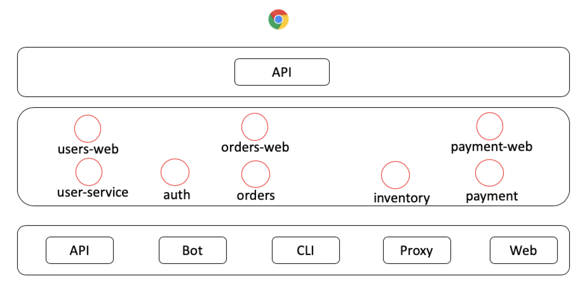

# 第三章 库存服务、订单服务、支付服务与Session管理

我们先回顾下前面两章我们完成的工作

- 第一章 初步完成了用户服务部分的两个子服务**user-web**和**user-srv**
- 第二章 完成**auth**服务

待完成工作

- session 管理

而本章我们要完成剩下的几个web服务以及它们各自对应的服务层应用

- **orders-web**、**orders-srv**
- **inventory-srv**
- **payment-web**、**payment-srv**

下面我们大体介绍下个web和service服务主要有哪些功能

因为几个web是各自分布的，所以，我们需要一个session在几个web之间流转，共享当前用户会话信息。

所以，接下来，我们先从session开始

## session

什么是session，session一般称作会话，服务端与客户端建立连接时，服务端用来确定客户端身份的一种临时状态，它的生命周期取决于服务端何时删除会话或客户端主动关闭连接。

首先，为什么我们要引入session，这是因为http在客户端与服务端之间彼此信息交互时，是没有状态的，即是说多次请求，都无法确认用户身份。所以我们需要使用session会话这种能够确认身份的机制。

那么，怎么样生成和管理session才使得http请求有状态呢？

我们简单用流程图表示



首先，如果服务器要知道请求是一个客户端发出的，那么就需要用户在每次请求时都带上一个身份识别id，我们叫它**sessionId**。

如何带上这个**sessionId**？主要有两种方式：

- 第一次请求时通过重定向或跳转将sessionId附加到url后变成参数，比如 **http://www.micro.mu?sessionId=123**。
- 通过 cookies 保存在客户端，每次请求时存放有sessionId的cookies会被传到服务器。

两种方式都有各种的优势，前者不需要cookie支持，在客户端禁掉cookie时仍能工作。后者通过自包含可以存放更多信息，只是要让客户端打开cookie缓存。

由上面的流程图中我们可以看到，服务端在获取**sessionId**后会向已经缓存起来的哈希表中查找，如果不存在，就会生成新的跳转回去让客户端重新请求（也可能会继续往下处理，看业务与技术设计，并无标准答案，但是道理一致）

至于生成sessionId的逻辑与安全因素，还有实现session管理包，这大大超过了本系列的讨论范畴，我们不考虑，直接使用开源的现成包即可。

我们使用[gorilla的session][gorilla-session]包，它采用的是cookie的解决方案：

```bash
$ go get -v github.com/gorilla/sessions
```

**gorilla-session**使用起来非常简单，我们着重使用，不过多介绍它，有兴趣的同学可以翻阅[资料][gorilla-session]。

我们定义一个**gorilla.go**文件，将其放到插件包[**plugin**](./plugins/session/gorilla.go)下，需要引用的web服务直接import该包即可。

我们也不去封装，直接使用原生的方法，尽管不太优雅，毕竟不是本系列的重点。

**gorilla.go**

```go
package session

// ...

var (
    sessionIdNamePrefix = "session-id-"
    store               *sessions.CookieStore
)

func init() {
    // 随机生成32位加密的key，切记，正式环境一定不要暴露，通过写到环境变量或其它安全方式
    // 我们是为了演示的步骤简单些，才直接硬编码
    store = sessions.NewCookieStore([]byte("OnNUU5RUr6Ii2HMI0d6E54bXTS52tCCL"))
}

// GetSession 获取当前会话session
func GetSession(w http.ResponseWriter, r *http.Request) *sessions.Session {

    // sessionId
    var sId string

    for _, c := range r.Cookies() {
        if strings.Index(c.Name, sessionIdNamePrefix) == 0 {
            sId = c.Name
            break
        }
    }

    // 如果cookie中没有sessionId的值，则使用随机生成
    if sId == "" {
        sId = sessionIdNamePrefix + uuid.New().String()
    }

    // 忽略错误，因为Get方法会一直都返回session
    ses, _ := store.Get(r, sId)
    // 没有id说明是新session
    if ses.ID == "" {
        // 将sessionId设置到cookie中
        cookie := &http.Cookie{Name: sId, Value: sId, Path: "/", Expires: time.Now().Add(30 * time.Second), MaxAge: 0}
        http.SetCookie(w, cookie)

        // 保存新的session
        ses.ID = sId
        ses.Save(r, w)
    }
    return ses
}
```

- 再次提醒，**NewCookieStore**的密钥一定不要硬编码到代码中，这样非常不安全，要写到配置中或其它相对安全的方式。

上述代码中获取当前session的方法**GetSession**，它先从cookie中获取是否有**session-id**为前缀的key，如果有，它就是session的密文。不过，这里有个漏洞，就是我们显式在cookies中声明某个value是**session-id**。

一般而言，为了安全，我们不会称名字为叫**session-id**，而是换个其它名称，而且也不会把值直接暴露，会再进行一次加密（gorilla已经加密过）。同时，我们也不能暴露cookie中每个键值对的彼此之间的关系，这样更安全。

不过，细心的朋友可能会发现一个bug，我们来看下面**GetSession**的片段代码

```go
// GetSession 获取当前会话session
func GetSession(w http.ResponseWriter, r *http.Request) *sessions.Session {

    // ...
    for _, c := range r.Cookies() {
        if strings.Index(c.Name, sessionIdNamePrefix) == 0 {
            sId = c.Name
            break
        }
    }
```

当for循环找到第一个名称前缀为**session-id**的cookie时，就会认为这个Name即为我们要找的session，其实，客户端是可以存在多条Name前缀为**session-id**的cookie的。为了简便我们不去优化，朋友们可以自行优化。

session管理部分的代码我们基本写完了。接下来我们要开始写业务逻辑代码

## 开始写代码

准备工作，执行SQL，创建我们需要的基础表（请忽略表结构的严谨性，只是为了演示Micro开发流程），SQL脚本见[schema.sql](./docs/schema.sql)。

在开始写之前，我们先总结一下要解决的几个问题：

- 如何在多个web服务之间，共享session
- **orders-srv**订单服务，**inventory-srv**库存服务，**payment-srv**支付服务之间如何协作，确认下单与支付。

第一个问题，如何在多个web服务之间，共享session。上面的**GetSession**中我们明显看到，每个web服务都是自己有**GetSession**方法的，那要如何保证它们对于同一客户端得到的session是一样的呢？

由于我们采用的是**gorilla-session**，它支持两种方式让各web之间共享session

- 基于CookieStore，各节点只要加密的密钥一致，即可共享缓存在cookie中的session信息
- 自定义store服务端存储，详见[服务端存储实现](https://github.com/gorilla/sessions/blob/master/README.md#store-implementations)

为了简单，我们使用基于Cookie的方案。而这个方案只要求各节点之间共享密钥：

```go
sessions.NewCookieStore([]byte("OnNUU5RUr6Ii2HMI0d6E54bXTS52tCCL"))
```

在调用**NewCookieStore**时，我们需要传入相同的密钥即可，各web服务都会使用同一密钥解密cookie中的session，得到同样的结果，从而保证会话可共享。

第二个问题，**inventory-srv**服务销存一笔记录时，如何确保该笔记录被消费。我们用下图来描述：



图中，蓝色是下单流程，红色是支付流程，两个流程都会走向inventory服务。

- 下单流程最后一步调用库存服务**Inventory.Sell**生成一笔记录但标记为未出单，并返回订单orderId
- 支付流程最后一步调用库存服务**Inventory.Confirm**确认将未出单的库存记录设置置为出单，并广播支付成功消息。

### 生成服务代码

由于前面两章我们已经介绍了如何编写web和service服务，剩下的几个服务与**user**相比也没有特别的地方，所以我们直接略过非必要的业务代码介绍，大家直接翻看相关目录的代码，以及建表记录可在[schema.sql](./docs/schema.sql)查看。

各服务生成模型命令：

**inventory-srv**

```bash
$  micro new --namespace=mu.micro.book --type=srv --alias=inventory github.com/micro-in-cn/tutorials/microservice-in-micro/part3/inventory-srv
```

**order-web**

```bash
$  micro new --namespace=mu.micro.book --type=web --alias=order github.com/micro-in-cn/tutorials/microservice-in-micro/part3/orders-web
```

**order-srv**

```bash
$  micro new --namespace=mu.micro.book --type=srv --alias=order github.com/micro-in-cn/tutorials/microservice-in-micro/part3/orders-srv
```

**payment-web**

```bash
$  micro new --namespace=mu.micro.book --type=web --alias=payment github.com/micro-in-cn/tutorials/microservice-in-micro/part3/payment-web
```

**payment-srv**

```bash
$  micro new --namespace=mu.micro.book --type=srv --alias=payment github.com/micro-in-cn/tutorials/microservice-in-micro/part3/payment-srv
```

### 下单与支付

下单流程

|---|服务名|接口|说明|
|---|---|---|---|
|1|**orders-web**|/orders/new|用户向该接口提交订单|
|2|**orders-srv**|Orders.New|web向service提交订单|
|3|**inventory-srv**|Inventory.Sell|service向库存服务请求销存|

支付流程

|---|服务名|接口|说明|
|---|---|---|---|
|1|**payment-web**|/payment/pay-order|用户向该接口提交支付|
|2|**payment-srv**|Payment.PayOrder|web向service交支付|
|3|**inventory-srv**|Inventory.Confirm|service向库存服务确认出库|
|4|**payment-srv**|pub：mu.micro.book.topic.payment.done|service广播支付完成|
|5|**orders-srv**|sub：mu.micro.book.topic.payment.done|接收支付完成消息|

我们从最底层的**inventory-srv**库存服务开始编写

### 库存服务

库存服务有两个大功能

- Sell 销存，调用此接口时，库存数会减一，但是会标记为未出库状态
- Confirm 确认销存，调用此接口会把销存确认为出库

[inventory_post.go](./inventory-srv/model/inventory/inventory_post.go)

```go
package inventory

// ...

// Sell 销存
func (s *service) Sell(bookId int64, userId int64) (id int64, err error) {

    // 获取数据库
	tx, err := db.GetDB().Begin()
	if err != nil {
		log.Logf("[Sell] 事务开启失败", err.Error())
		return
	}
	defer func() {
		if err != nil {
			tx.Rollback()
		}
	}()

	querySQL := `SELECT id, book_id, unit_price, stock, version FROM inventory WHERE book_id = ?`

	inv := &proto.Inv{}

	updateSQL := `UPDATE inventory SET stock = ?, version = ?  WHERE book_id = ? AND version = ?`

	// 销存方法，通过version字段避免脏写
	var deductInv func() error
	deductInv = func() (errIn error) {

		// 查询
		errIn = tx.QueryRow(querySQL, bookId).Scan(&inv.Id, &inv.BookId, &inv.UnitPrice, &inv.Stock, &inv.Version)
		if errIn != nil {
			log.Logf("[Sell] 查询数据失败，err：%s", errIn)
			return errIn
		}

		if inv.Stock < 1 {
			errIn = fmt.Errorf("[Sell] 库存不足")
			log.Logf(errIn.Error())
			return errIn
		}

		r, errIn := tx.Exec(updateSQL, inv.Stock-1, inv.Version+1, bookId, inv.Version)
		if errIn != nil {
			log.Logf("[Sell] 更新库存数据失败，err：%s", errIn)
			return
		}

		if affected, _ := r.RowsAffected(); affected == 0 {
			log.Logf("[Sell] 更新库存数据失败，版本号%d过期，即将重试", inv.Version)
			// 重试，直到没有库存
			deductInv()
		}

		return
	}

	// 开始销存
	err = deductInv()
	if err != nil {
		log.Logf("[Sell] 销存失败，err：%s", err)
		return
	}

	insertSQL := `INSERT inventory_history (book_id, user_id, state) VALUE (?, ?, ?) `
	r, err := tx.Exec(insertSQL, bookId, userId, common.InventoryHistoryStateNotOut)
	if err != nil {
		log.Logf("[Sell] 新增销存记录失败，err：%s", err)
		return
	}

	// 返回历史记录id，作为流水号使用
	id, _ = r.LastInsertId()

	// 忽略error
	tx.Commit()

	return
}

// Confirm 确认销存
func (s *service) Confirm(id int64, state int) (err error) {

	updateSQL := `UPDATE inventory_history SET state = ? WHERE id = ?;`

	// 获取数据库
	o := db.GetDB()

	// 查询
	_, err = o.Exec(updateSQL, state, id)
	if err != nil {
		log.Logf("[Confirm] 更新失败，err：%s", err)
		return
	}
	return
}
```

#### Sell

**Confirm**方法执行的逻辑比较简单，就是通过流水号（inventory_history表的id）更新支付状态。

我们重点讲一下**Sell**流程，因为**Sell**方法会对两张表进行写操作，故而我们需要开启事务

```go
    o := db.GetDB()
	tx, err := o.Begin()
	if err != nil {
		log.Logf("[Sell] 事务开启失败", err.Error())
		return
	}
	defer func() {
		if err != nil {
			tx.Rollback()
		}
	}()
```

并在通过**defer**指令声明在方法执行完后查错再回滚。

而后我们又定义了**deductInv**内部方法，该方法用来减小库存，因为库存操作可能是并发的，可能会有很多请求同时操作一笔数据，所以我们加了**version**版本号来确认没有脏写。

```go
    deductInv = func() (errIn error) {

		// 查询
		errIn = tx.QueryRow(querySQL, bookId).Scan(&inv.Id, &inv.BookId, &inv.UnitPrice, &inv.Stock, &inv.Version)
		if errIn != nil {
			log.Logf("[Sell] 查询数据失败，err：%s", errIn)
			return errIn
		}

		if inv.Stock < 1 {
			errIn = fmt.Errorf("[Sell] 库存不足")
			log.Logf(errIn.Error())
			return errIn
		}

		r, errIn := tx.Exec(updateSQL, inv.Stock-1, inv.Version+1, bookId, inv.Version)
		if errIn != nil {
			log.Logf("[Sell] 更新库存数据失败，err：%s", errIn)
			return
		}

		if affected, _ := r.RowsAffected(); affected == 0 {
			log.Logf("[Sell] 更新库存数据失败，版本号%d过期，即将重试", inv.Version)
			// 重试，直到没有库存
			deductInv()
		}

		return
	}
```

**deductInv**方法内部会有递归，在**version**版本号过期后会重新执行。更新记录成功后，再插入历史记录，标记出单状态为**未出库**

```go
    insertSQL := `INSERT inventory_history (book_id, user_id, state) VALUE (?, ?, ?) `
	r, err := o.Exec(insertSQL, bookId, userId, common.InventoryHistoryStateNotOut)
	if err != nil {
		log.Logf("[Sell] 新增销存记录失败，err：%s", err)
		return
	}

    // 返回历史记录id，作为流水号使用
	id, _ = r.LastInsertId()
```

最后，提交事务

```go
	tx.Commit()
```

### 订单服务

订单服务需要实现下面的接口：

- /orders/new，用户使用该接口进行下单操作

该接口有两个子服务协作完成，**orders-web**和**orders-srv**，前者作为订单服务的门面层，后者则是真正的核心业务层。

**orders-srv**通过RPC向**payment-srv**请求占用一条库存，通过侦听**inventory-srv**广播的支付事件更新订单支付状态。

#### 代码详解

由于两个服务与前面我们所说服务并无特别的地方，我们跳过非核心代码解读。感兴趣的朋友可以直接翻阅代码[orders-web](./orders-web)和[orders-srv](./orders-srv)

如我们上面画的请求路线中所示，orders服务在下单时会调用inventory请求占有一单为待出单状态，成功后才会进入新增订单写入数据库操作。

[**orders_post.go**](./orders-srv/model/orders/orders_post.go)

```go
// New 新增订单
func (s *service) New(bookId int64, userId int64) (orderId int64, err error) {

	// 请求销存
	rsp, err := invClient.Sell(context.TODO(), &invS.Request{
		BookId: bookId, UserId: userId,
	})
	if err != nil {
		log.Logf("[New] Sell 调用库存服务时失败：%s", err.Error())
		return
	}

	// 获取数据库
	o := db.GetDB()
	insertSQL := `INSERT orders (book_id, inv_his_id, state) VALUE (?, ?, ?, ?)`

	r, errIn := o.Exec(insertSQL, bookId, rsp.InvH.Id, common.InventoryHistoryStateNotOut)
	if errIn != nil {
		log.Logf("[New] 新增订单失败，err：%s", errIn)
		return
	}
	orderId, _ = r.LastInsertId()
	return
}
```

而在orders的main方法中，我们侦听了订单支付事件

[**main.go**](./orders-srv/main.go)

```go
func main() {

	// 侦听订单支付消息
	err := micro.RegisterSubscriber(common.TopicPaymentDone, service.Server(), subscriber.PayOrder)
	if err != nil {
		log.Fatal(err)
	}
```

侦听处理函数由**subscriber.PayOrder**负责，它处理消息成功后便更新订单为支付（出库）状态。

```go
// PayOrder 订单支付消息
package subscriber

import (
	// ...
)

var (
	ordersService orders.Service
)

// Init 初始化handler
func Init() {
	ordersService, _ = orders.GetService()
}

// PayOrder 订单支付消息
func PayOrder(ctx context.Context, event *payS.PayEvent) (err error) {

	log.Logf("[PayOrder] 收到支付订单通知，%d，%d", event.OrderId, event.State)
	err = ordersService.UpdateOrderState(event.OrderId, int(event.State))
	if err != nil {
		log.Logf("[PayOrder] 收到支付订单通知，更新状态异常，%s", err)
		return
	}
	return
}

```

### 支付服务

支付服务需要实现下面的接口：

- /payment/pay-order，用户使用该接口支付订单

该接口有两个子服务协作完成，**payment-web**和**payment-srv**。它的核心处理流程为：

- **payment-srv**通过RPC向**order-srv**查询订单详情信息
- 更新支付状态
- 广播支付成功消息

#### 代码详解

支付接口**PayOrder**接收订单id，简单验证订单正确后确认出库，然后广播出库成功通知

**payment_post.go**

```go
// PayOrder 支付订单
func (s *service) PayOrder(orderId int64) (err error) {

	// 插入支付记录
	// ...
	
	// 确认出库
	invRsp, err := invClient.Confirm(context.TODO(), &invS.Request{
		HistoryId: orderRsp.Order.InvHistoryId,
	})
	if err != nil || invRsp == nil || !invRsp.Success {
		err = fmt.Errorf("[PayOrder] 确认出库失败，%s", err)
		log.Logf("%s", err)
		return
	}

	// 广播支付成功
	s.sendPayDoneEvt(orderId, common.InventoryHistoryStateOut)

	tx.Commit()

	return
}
```

下面的是负责广播支付成功通知事件的方法

**payment_evt.go**

```go
func (s *service) sendPayDoneEvt(orderId int64, state int32) {

	// 构建事件
	ev := &proto.PayEvent{
		Id:       uuid.New().String(),
		SentTime: time.Now().Unix(),
		OrderId:  orderId,
		State:    state,
	}

	log.Logf("[sendPayDoneEvt] 发送支付事件，%+v\n", ev)

	// 广播事件
	if err := payPublisher.Publish(context.Background(), ev); err != nil {
		log.Logf("[sendPayDoneEvt] 异常: %v", err)
	}
}
```

## 演示

至此，我们的程序也基本写完了。下面我们开始测试代码，我们打开几个终端，目录都切到part3下，依次执行下面的命令：

**API**

```bash
$ micro --registry=consul --api_namespace=mu.micro.book.web  api --handler=web
```

**user-srv**

```bash
$ cd user-srv
$ go run main.go plugin.go
```

**user-web**

```bash
$ cd user-web
$ go run main.go plugin.go
```

**payment-srv**

```bash
$ cd payment-srv
$ go run main.go plugin.go
```

**payment-web**

```bash
$ cd payment-web
$ go run main.go plugin.go
```

**orders-web**

```bash
$ cd orders-web
$ go run main.go plugin.go
```

**orders-srv**

```bash
$ cd orders-srv
$ go run main.go plugin.go
```

**inventory**

```bash
$ cd inventory-srv
$ go run main.go plugin.go
```

**auth**

```bash
$ cd auth
$ go run main.go plugin.go
```

由于我们用的token及session都使用了cookie，所以我们在发curl请求时，会有太长的请求命令。

限于篇幅，大家使用postman验证结果，在postman中导入请求模板[**postman_collection.json**](../docs/postman_collection.json)即可。

以下面步骤验证：

- 登录 http://127.0.0.1:8080/user/login
- 新建订单 http://127.0.0.1:8080/orders/new
- 支付订单 http://127.0.0.1:8080/payment/pay-order
- 查数据库inventory，inventory_history，orders，payment各表记录

## 总结

我们基本实现了我们的业务流程，尽管没有去详细测试每个细节，但是这不是我们本系列文章的重点。

我们本章用到的Micro技术点有：

- [**micro new**][micro-new-code]，生成Micro风格的模板代码，它是micro项目中的一个子包。
- [**protoc-gen-go**][protoc-gen-go]，隐藏在`protoc ... --micro_out`指令中执行了，感兴趣的同学可以去了解一下。
- [**go-micro**][go-micro]，代码中**micro.NewService**，**service.Init**等都是go-micro中不同类型服务各自实现的方法。
- [**go-config**][go-config]，加载配置时使用。
- [**go-web**][go-web]，编写web应用**payment-web**、**orders-web**时用到。
- [**go-broker**][go-broker]，编写web应用**payment-srv**与**orders-srv**时用到。

不足点有：

- 每个proto文件都有一个错误类，属于冗余代码
- 每个web的返回JSON结构没有统一，目前是各自输出
- 没有统一错误码
- 大量的client.DefaultClient声明，一个服务中应该只需要一个client
- 没有实现session退出广播，这点大家可以参考支付事件**mu.micro.book.topic.payment.done**自行实现
- AuthWrapper每个web各自维护一套，需要优化

至此，我们完成全部的服务：



以后的章节中，我们会在此基础上不断加入Micro的特性。请翻阅下一章

## 系列文章

- [第一章 用户服务][第一章]
- [第二章 权限服务][第二章]
- [第四章 使用配置中心][第四章]
- [第五章 日志持久化][第五章]
- [第六章 熔断、降级、容错与健康检查][第六章]
- [第七章 链路追踪][第七章]
- [第八章 容器化][第八章]

## 讨论

朋友，请加入[slack](http://slack.micro.mu/)，进入**中国区**Channel沟通。

## 延伸阅读

[gorilla-session][gorilla-session]

[micro-new]: https://github.com/micro-in-cn/all-in-one/tree/master/middle-practices/micro-new
[protoc-gen-go]: https://github.com/micro/protoc-gen-micro
[micro-new-code]: https://github.com/micro/micro/tree/master/new
[go-micro]: https://github.com/micro/go-micro
[go-config]: https://github.com/micro/go-micro/config
[go-web]: https://github.com/micro/go-web
[go-broker]: https://github.com/micro/go-micro/broker
[jwt]: https://jwt.io/introduction/
[gorilla-session]: https://github.com/gorilla/sessions

[第一章]: ../part1
[第二章]: ../part2
[第四章]: ../part4
[第五章]: ../part5
[第六章]: ../part6
[第七章]: ../part7
[第八章]: ../part8
