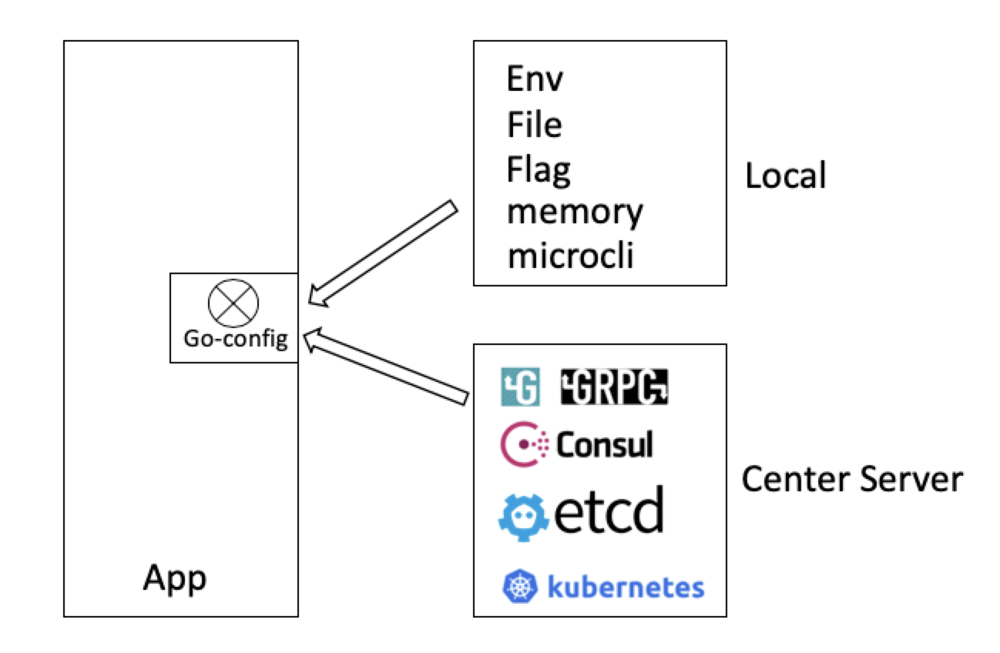
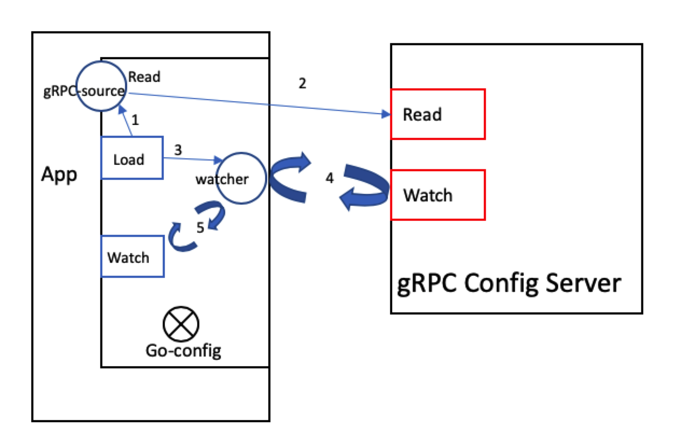

# 第四章 使用配置中心

前面的章节中，我们把配置以yml文件的方式放到配置目录**conf**中，并通过**go-config**把其加载读到应用中。

Micro生态链中使用**go-config**管理配置，但是目前**go-config**定位是客户端插件，即是说它**并没有**充当配置中心的能力，不过，可以通过接口使用其它如consul、etcd、k8s等具备kv存储能力的配置服务器。

**go-config**与配置服务器组合，足以俱备配置中心的能力。

go-config在Micro体系中工作层次如下图所示：



本章我们重点介绍如何使用gRPC作为配置中心，因为consul、etcd、k8s使用方式大同小异，不过多赘述。

go-config所有使用方式，包括本地与中心服务可参考下列示例

- [Env](https://github.com/micro-in-cn/tutorials/examples/tree/master/middle-practices/micro-config/env) 本地 基于环境变量
- [File](https://github.com/micro-in-cn/tutorials/examples/tree/master/basic-practices/micro-config) 本地 基于配置文件
- [Flag](https://github.com/micro-in-cn/tutorials/examples/tree/master/middle-practices/micro-config/flag) 本地 基于命令行Flag参数文件
- [memory](https://github.com/micro-in-cn/tutorials/examples/tree/master/middle-practices/micro-config/memory) 本地 基于内存方式配置
- [microcli](https://github.com/micro-in-cn/tutorials/examples/tree/master/middle-practices/micro-config/microcli) 本地 基于MicroCli参数配置
- [gRPC](https://github.com/micro-in-cn/tutorials/examples/tree/master/senior-practices/micro-config/gRPC) 使用gRPC服务作为配置中心
- [Consul](https://github.com/micro-in-cn/tutorials/examples/tree/master/senior-practices/micro-config/consul) 使用Consul服务作为配置中心
- [etcd](https://github.com/micro-in-cn/tutorials/examples/tree/master/senior-practices/micro-config/consul) 使用etcd服务作为配置中心
- [k8s](https://github.com/micro-in-cn/tutorials/examples/tree/master/senior-practices/micro-config/consul) 使用K8s服务作为配置中心

## gRPC Server

应用与gRPC Server之间的交互如下



如图所示，Go-config与Config Server交互有下面几个重要点：

- Load方法负责触发指定配置源的Read（Next）方法，并向配置中心Read接口请求配置数据
- 同时，Load会初始化侦听器Watcher，它负责循环向数据中心的Watch接口请求最新配置，并判断是否有数据变动
- Watcher判断有变动后，把变动通过Next方法告诉应用

|客户端|go-config中间层|服务端
|---|---|---
|Read|Read->Watch->Next|Read
|Watch|Watch->Next|Watch

注意，客户端Read逻辑和Watch逻辑虽然都有**Watch->Next**步骤，但是各自的逻辑是不一样的。它们由不同的loadWatch监管。

我们来看gRPC Config Server的核心代码

```go
func main() {

	// 灾难恢复
	defer func() {
		if r := recover(); r != nil {
			log.Logf("[main] Recovered in f %v", r)
		}
	}()

	// 加载并侦听配置文件
	err := loadAndWatchConfigFile()
	if err != nil {
		log.Fatal(err)
	}

	// 新建grpc Server服务
	service := grpc2.NewServer()
	proto.RegisterSourceServer(service, new(Service))
	ts, err := net.Listen("tcp", ":9600")
	if err != nil {
		log.Fatal(err)
	}
	log.Logf("configServer started")

	// 启动
	err = service.Serve(ts)
	if err != nil {
		log.Fatal(err)
	}
}

func (s Service) Read(ctx context.Context, req *proto.ReadRequest) (rsp *proto.ReadResponse, err error) {

	appName := parsePath(req.Path)

	rsp = &proto.ReadResponse{
		ChangeSet: getConfig(appName),
	}
	return
}

func (s Service) Watch(req *proto.WatchRequest, server proto.Source_WatchServer) (err error) {

	appName := parsePath(req.Path)
	rsp := &proto.WatchResponse{
		ChangeSet: getConfig(appName),
	}
	if err = server.Send(rsp); err != nil {
		log.Logf("[Watch] 侦听处理异常，%s", err)
		return err
	}

	return
}

func loadAndWatchConfigFile() (err error) {

	// 加载每个应用的配置文件
	for _, app := range apps {
		if err := config.Load(file.NewSource(
			file.WithPath("./conf/" + app + ".yml"),
		)); err != nil {
			log.Fatalf("[loadAndWatchConfigFile] 加载应用配置文件 异常，%s", err)
			return err
		}
	}

	// 侦听文件变动
	watcher, err := config.Watch()
	if err != nil {
		log.Fatalf("[loadAndWatchConfigFile] 开始侦听应用配置文件变动 异常，%s", err)
		return err
	}

	go func() {
		for {
			v, err := watcher.Next()
			if err != nil {
				log.Fatalf("[loadAndWatchConfigFile] 侦听应用配置文件变动 异常， %s", err)
				return
			}

			log.Logf("[loadAndWatchConfigFile] 文件变动，%s", string(v.Bytes()))
		}
	}()

	return
}
```

首先，为了方便，我们把所有的配置都放到micro空间下，并写在一个配置文件[micro.yml](./config-grpc-srv/conf/micro.yml)中。

先来看**loadAndWatchConfigFile**方法

[**main.go**](./config-grpc-srv/main.go)

```go
func loadAndWatchConfigFile() (err error) {

	// 加载每个应用的配置文件
	for _, app := range apps {
		if err := config.Load(file.NewSource(
			file.WithPath("./conf/" + app + ".yml"),
		)); err != nil {
			return err
		}
	}

	// 侦听文件变动
	watcher, err := config.Watch()
	if err != nil {
		return err
	}

	go func() {
		for {
			v, err := watcher.Next()
			if err != nil {
				return
			}
		}
	}()

	return
}
```

**loadAndWatchConfigFile**方法把所有指定的配置文件加载到**go-config**中，然后通过**go-config**的**Watch**来侦听文件变动。

如果文件有变动，**config.get**方法拿到的数据便会是最新的：

**getConfig**

```go
func getConfig(appName string) *proto.ChangeSet {

	bytes := config.Get(appName).Bytes()

	log.Logf("[getConfig] appName：%s", appName)
	return &proto.ChangeSet{
		Data:      bytes,
		Checksum:  fmt.Sprintf("%x", md5.Sum(bytes)),
		Format:    "yml",
		Source:    "file",
		Timestamp: time.Now().Unix()}
}
```

**proto.ChangeSet**规范了配置返回格式：

- Data  具体的配置比特码
- Checksum  本次请求的数据签名，用于判断data是否传输完成
- Format  格式
- Source  配置源
- Timestamp 返回服务端处理完成时的时间戳

**proto.ChangeSet**由**Read**和**Watch**返回：

```go
func (s Service) Read(ctx context.Context, req *proto.ReadRequest) (rsp *proto.ReadResponse, err error) {

	appName := parsePath(req.Path)

	rsp = &proto.ReadResponse{
		ChangeSet: getConfig(appName),
	}
	return
}

func (s Service) Watch(req *proto.WatchRequest, server proto.Source_WatchServer) (err error) {

	appName := parsePath(req.Path)
	rsp := &proto.WatchResponse{
		ChangeSet: getConfig(appName),
	}
	if err = server.Send(rsp); err != nil {
		log.Logf("[Watch] 侦听处理异常，%s", err)
		return err
	}

	return
}
```

客户端通过**Next**方法与**Watch**交互，有变动时即更新本地配置。

## client

有了服务端，我们还需要有客户端来调用和侦听配置。见代码：

[**config.go**](./basic/config/config.go)

```go
package config

import (
	"fmt"
	"github.com/micro/go-micro/config"
	"github.com/micro/go-micro/util/log"
	"sync"
)

var (
	m      sync.RWMutex
	inited bool

	// 默认配置器
	c = &configurator{}
)

// Configurator 配置器
type Configurator interface {
	App(name string, config interface{}) (err error)
}

// configurator 配置器
type configurator struct {
	conf config.Config
}

func (c *configurator) App(name string, config interface{}) (err error) {

	v := c.conf.Get(name)
	if v != nil {
		err = v.Scan(config)
	} else {
		err = fmt.Errorf("[App] 配置不存在，err：%s", name)
	}

	return
}

// c 配置器
func C() Configurator {
	return c
}

func (c *configurator) init(ops Options) (err error) {
	m.Lock()
	defer m.Unlock()

	if inited {
		log.Logf("[init] 配置已经初始化过")
		return
	}

	c.conf = config.NewConfig()

	// 加载配置
	err = c.conf.Load(ops.Sources...)
	if err != nil {
		log.Fatal(err)
	}

	go func() {

		log.Logf("[init] 侦听配置变动 ...")

		// 开始侦听变动事件
		watcher, err := c.conf.Watch()
		if err != nil {
			log.Fatal(err)
		}

		for {
			v, err := watcher.Next()
			if err != nil {
				log.Fatal(err)
			}

			log.Logf("[init] 侦听配置变动: %v", string(v.Bytes()))
		}
	}()

	// 标记已经初始化
	inited = true
	return
}

// Init 初始化配置
func Init(opts ...Option) {

	ops := Options{}
	for _, o := range opts {
		o(&ops)
	}

	c = &configurator{}

	c.init(ops)
}
```

客户端有两个部分组成

- Configurator 配置器 负责提供给客户端获取配置
- Init/init 初始化接口与内部方法 负责初始化并同步配置服务器回传的配置变动

我们实现的客户端并不限制数据源是gRPC或者像consul这样的资源服务都可以直接调用**Init**进行初始化。

## 应用代码

我们把所有应用的conf目录全部删掉，都改成从配置中心读取配置，但是实际情况中我们会通常会在应用中保留必要的配置文件及配置属性，但是这里我们不考虑太多。

**main**中主要结构：

```go
var (
	appName = "user_web"
	cfg     = &userCfg{}
)

type userCfg struct {
	common.AppCfg
}

func main() {

	// 初始化配置
	initCfg()

	// 使用consul注册
	// 创建新服务
	service := web.NewService(
		web.Name(cfg.Name),
		web.Version(cfg.Version),
		web.Registry(micReg),
		web.Address(cfg.Addr()),
	)

	// 初始化服务
	// ...
	// 运行服务
}

func registryOptions(ops *registry.Options) {

	consulCfg := &common.Consul{}
	err := config.C().App("consul", consulCfg)
	if err != nil {
		panic(err)
	}

	ops.Timeout = time.Second * 5
	ops.Addrs = []string{fmt.Sprintf("%s:%d", consulCfg.Host, consulCfg.Port)}
}

func initCfg() {

	source := grpc.NewSource(
		grpc.WithAddress("127.0.0.1:9600"),
		grpc.WithPath("micro"),
	)

	basic.Init(config.WithSource(source))

	err := config.C().App(appName, cfg)
	if err != nil {
		panic(err)
	}

	log.Logf("[initCfg] 配置，cfg：%v", cfg)

	return
}
```

main第一步执行初始化方法**initCfg**，在其中声明使用grpc配置源，并通过**config.C().App**初始化应用的定制配置。

改动的地方都比较简单，初始化等没有进行封装，这是为了让大家容易理解，在此不一一讲解。

## 总结

本篇，引入了配置中心，采用gRPC Server作为配置中心服务，并把所有应用的配置都放到配置中心统一管理。

不足点有：

- gRPC Server并没有实现高可用与负载均衡，不过这超过了本篇的讨论范畴，我们会有专门的教程来实现。

## 参考阅读

- [如何使用gRPC编写服务](https://medium.com/pantomath/how-we-use-grpc-to-build-a-client-server-system-in-go-dd20045fa1c2)

## 系列文章

- [第一章 用户服务][第一章]
- [第二章 权限服务][第二章]
- [第三章 库存服务、订单服务、支付服务与Session管理][第三章]
- [第五章 日志持久化][第五章]
- [第六章 熔断、降级、容错与健康检查][第六章]
- [第七章 链路追踪][第七章]
- [第八章 容器化][第八章]

[第一章]: ../part1
[第二章]: ../part2
[第三章]: ../part3
[第四章]: ../part4
[第五章]: ../part5
[第六章]: ../part6
[第七章]: ../part7
[第八章]: ../part8
