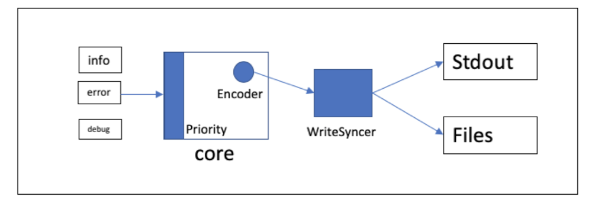

# 第五章 日志持久化【Updating 20200304】

Go-Micro在V2.1.0-V2.2.0版本中持续增强了Logger组件。详情代码可在go-micro/logger下查看。

默认使用仍然标准输出，并不输出到文件，不过[Go-Plugins](https://github.com/micro/go-plugins)插件库中在常见的日志库Logger实现，比如Zap，Logrus等。插件库中对这些库进行了封装，我们可以简单声明即可使用这些库。

本章主要内容

- [介绍Logger](#Logger)
- [micro中为什么日志不分级](#为什么Micro中日志不分级)
- [持久化日志](持久化日志)

## Logger

Logger主要有三个部分组成：

- Logger：定义日志器接口
- Level：定义打印级别，以及用户直接调用的SugarAPI（如：log.Debug/Info等等）
- Helper：日志辅助器，调用者不用关心，它桥接Level与Logger实现。

我们先看看**Logger**提供的接口

```go
type Logger interface {
	// Init initialises options
	Init(options ...Option) error
	// The Logger options
	Options() Options
	// Fields set fields to always be logged
	Fields(fields map[string]interface{}) Logger
	// Log writes a log entry
	Log(level Level, v ...interface{})
	// Logf writes a formatted log entry
	Logf(level Level, format string, v ...interface{})
	// String returns the name of logger
	String() string
}
```

用户打印日志时，直接调用的并不是上面的方法。Go-Micro只是规范了日志要实现这些方法。我们要调用的是下面的Level中的方法：

```go
func Infof(template string, args ...interface{}) {
	DefaultLogger.Logf(InfoLevel, template, args...)
}

func Trace(args ...interface{}) {
	DefaultLogger.Log(TraceLevel, args...)
}

func Tracef(template string, args ...interface{}) {
	DefaultLogger.Logf(TraceLevel, template, args...)
}

func Debug(args ...interface{}) {
	DefaultLogger.Log(DebugLevel, args...)
}
... (Debug/Debugf等)
```

### 为什么要Helper？

Logger中只有Log与Logf方法，它们可以接收日志级别，不再需要定义一堆Debug/Info/Error等接口，这样可以简化Logger的接口。而没有SugarAPI，为了大家能方便指定打印级别，需要Helper转换一下。

调用链关系大致如下：

```go
log.Debug(xxxx) -> helper.Debug(xxx)-> logger.Log(Debug,xxxx)
```

## 持久化日志

我们小篇幅讲解了Logger的结构，现在终于要讲如何实现持久化。

在实际的生产环境中，通常日志是要持久化到本地或者其它存储服务中的，比如db、es等。本章讲解如何使用[**Zap**][zap]作为日志插件，并实现将其持久化到本地文件中。

### 什么是zap

[**Zap**][zap]是Uber出品基于golang的日志工具库，具有高效、简单、结构化，支持分级等特性。

Zap支持以两种模式打印日志

- **结构** 结构模式支持以k/v的方式使用日志打印方法
- **性能** 性能模式则强制要求声明需要打印字段的类型，因为这样除去反射判断类型的时间，性能更好

### 定制zap

我们先在[**plugins**](./plugins)目录中加上zap子目录，在里面编写zap插件。然后直接在应用中引用包即可

zap插件目录 

- [**options.go**](./plugins/zap/options.go) 配置项
- [**zap.go**](./plugins/zap/zap.go) 插件主要代码

我们要zap完成以下功能

- 分级打印
- 持久化到文件
- 不同级别打印到不同文件
- 定时定量维护文件

zap日志可定制性很强，不过，默认的配置不满足我们的需求

我们需要加入插件[lumberjack](https://github.com/natefinch/lumberjack)才能满足需求。

**lumberjack**可以帮助我们生成指定文件名的日志文件，并且它可以维护日志文件，比如过期、压缩等。

安装**lumberjack**

```bash
go get gopkg.in/natefinch/lumberjack.v2
```

### 初始化配置

初始化的所需配置我们写在配置中心[config-grpc-srv](./config-grpc-srv/conf/micro.yml)中

对于每个应用，都需要有自己的配置zap选项，如下：

```yml
micro:
  auth_srv:
    name: mu.micro.book.srv.auth
    address: 127.0.0.1
    port: 9030
    zap:
      level: error
      development: true
      logFileDir:
      outputPaths: []
      maxSize: 50
      maxBackups: 200
      maxAge: 10
```

配置项|说明
---|---
level|打印指定级别及以上的日志
development|是否开发模式
logFileDir|日志文件存放目录
outputPaths|日志输出路径
maxSize|日志文件大小最大值
maxBackups|最大保存文件数
maxAge|最大保存天数

注册zap插件

```go
func init() {
	l = &Logger{
		Opts: &Options{},
	}
	basic.Register(initLogger)
}
```

其它**initLogger**方法中包含了zap的初始化逻辑

### zap初始化

zap 主要组件的工作流程如下图



日志通过zap.Core的Priority判断是否符合本core要打印的级别，如果是则转给encoder编码器，编码完成后交给**WriteSyncer**同步器写到文件中。

我们从同步器WriteSyncer开始入手，日志通常需要输出到控制台与持久化IO接口上，所以我们需要有两个类型的同步器。


**WriteSyncer**

```go
var (
	// ...
	errWS, warnWS, infoWS, debugWS zapcore.WriteSyncer       // IO输出
	debugConsoleWS                 = zapcore.Lock(os.Stdout) // 控制台标准输出
	errorConsoleWS                 = zapcore.Lock(os.Stderr)
)
```

加载配置

```go
func (l *Logger) loadCfg() {

	c := config.C()

	err := c.Path("zap", l.Opts)
	if err != nil {
		panic(err)
	}

    // 如果是开发模式则使用开发配置
	if l.Opts.Development {
		l.zapConfig = zap.NewDevelopmentConfig()
	} else {
		l.zapConfig = zap.NewProductionConfig()
	}
	
	// ...
}
```

设置IO输出同步器，我们定义四种级别的同步器error、warn、info、debug，它们各自负责输出自已级别的日志。

```go
func (l *Logger) setSyncers() {

	f := func(fN string) zapcore.WriteSyncer {
		return zapcore.AddSync(&lumberjack.Logger{
			Filename:   l.Opts.LogFileDir + sp + l.Opts.AppName + "-" + fN,
			MaxSize:    l.Opts.MaxSize,
			MaxBackups: l.Opts.MaxBackups,
			MaxAge:     l.Opts.MaxAge,
			Compress:   true,
			LocalTime:  true,
		})
	}

	errWS = f(l.Opts.ErrorFileName)
	warnWS = f(l.Opts.WarnFileName)
	infoWS = f(l.Opts.InfoFileName)
	debugWS = f(l.Opts.DebugFileName)

	return
}
```

将**priority**与**WriteSyncer**打包到**zap.core**中。

```go
func (l *Logger) cores() zap.Option {

	fileEncoder := zapcore.NewJSONEncoder(l.zapConfig.EncoderConfig)
	
	// ...
	
	errPriority := zap.LevelEnablerFunc(func(lvl zapcore.Level) bool {
		return lvl > zapcore.WarnLevel && zapcore.WarnLevel-l.zapConfig.Level.Level() > -1
	})

    // ...
    
	cores := []zapcore.Core{

		// error 及以上
		zapcore.NewCore(fileEncoder, errWS, errPriority),

		// warn
		zapcore.NewCore(fileEncoder, warnW, warnPriority),

		// ...
	}

	return zap.WrapCore(func(c zapcore.Core) zapcore.Core {
		return zapcore.NewTee(cores...)
	})
}
```

最后通过配置器**zapConfig**生成logger。

```go
    l.Logger, err = l.zapConfig.Build(l.cores())
	if err != nil {
		panic(err)
	}
    
    // Sync负责冲到缓冲区日志，压到文件中
    defer l.Logger.Sync()
```

## 将所有服务日志换成zap

我们用[auth](./auth)服务作示例

1. 在配置中心配置文件[micro.yml](./config-grpc-srv/conf/micro.yml)把zap配置加上：

```yml
micro:
  auth_srv:
    name: mu.micro.book.srv.auth
    address: 127.0.0.1
    port: 9030
    zap:
      level: error
      development: true
      logFileDir:
      outputPaths: []
      maxSize: 50
      maxBackups: 200
      maxAge: 10
```

2. 引入**zap**插件（可忽略，但是建议加上，包管理规范些）

[**plugin.go**](./auth/plugin.go)

```go
package main

import (
	// ...
	_ "github.com/micro-in-cn/tutorials/microservice-in-micro/part5/plugins/zap"
)
```

3. 在需要用到logger的地方使用zap插件暴露的方法**GetLogger**，按需要打印。

[**main.go**](./auth/main.go)

```go
package main

import (
	// ...
	z "github.com/micro-in-cn/tutorials/microservice-in-micro/part5/plugins/zap"
)

var (
	// ...
	log = z.GetLogger()
	// ...
)


func initCfg() {
	// ...
	log.Info("[initCfg] 配置", zap.Any("cfg", cfg))
	return
}
```

4. 启动服务后便会打印日志：

```bash
go run main.go plugin.go

## ...
1.557376266044878e+09   info    auth/main.go:97 [initCfg] 配置  {"cfg": {"name":"mu.micro.book.srv.auth","version":"","address":"127.0.0.1","port":9030}}
## ...
```

并在当前目录下的logs目录会有新的日志文件生成：

```bash
ls logs/

## 日志文件
app-debug.log   app-error.log   app-info.log    app-warn.log
```

## 其它持久化方案

- [filebeat](https://www.elastic.co/products/beats/filebeat) 侦听日志文件变动推送到ELK

## 总结

我们本篇简单介绍micro中的go-log，并引入zap作为我们的日志持久化插件，给大家演示了如何使用zap分级打印，如何持久化到文件。

其实zap还有很多功能，比如定制日志格式、增加field，我们不一一介绍。

[下一篇][第六章]我们会讲解在micro中如何使用熔断、降级、容错与健康检查。

## 参考阅读

[聊聊日志打印](https://dave.cheney.net/2015/11/05/lets-talk-about-logging)

## 系列文章

- [第一章 用户服务][第一章]
- [第二章 权限服务][第二章]
- [第三章 库存服务、订单服务、支付服务与Session管理][第三章]
- [第四章 使用配置中心][第四章]
- [第六章 熔断、降级、容错与健康检查][第六章]
- [第七章 链路追踪][第七章]
- [第八章 容器化][第八章]

[第一章]: ../part1
[第二章]: ../part2
[第三章]: ../part3
[第四章]: ../part4
[第五章]: ../part5
[第六章]: ../part6
[第七章]: ../part7
[第八章]: ../part8
[zap]: https://github.com/uber-go/zap