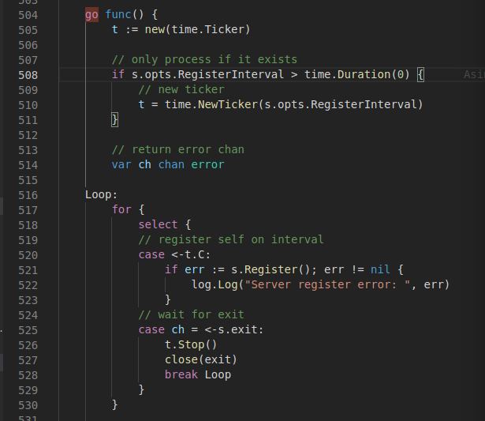

# 第六章 熔断、降级、容错与健康检查

## 熔断、降级、容错
todo

## 健康检查
在微服务架构中，每个服务都会存在多个实例，可能部署在不同的主机中。因为有网络或者主机等不确定因素，所以每个服务都可能会出现故障。我们需要能够掌握每个服务实例的健康状态，当一个服务故障时，及时将它从注册中心删除。

micro服务注册功能提供的两个参数来实现健康检查功能：
```
micro.RegisterTTL(time.Second*30)
micro.RegisterInterval(time.Second*20)
```
Interval就是间隔多久服务会自动重新注册，TTL就是注册服务的过期时间，如果服务超过过期时间没有去重新注册，注册中心会将其删除。

其实现在go-micro/server/rpc_server.go中,micro使用一个定时器按照设定的间隔时间去自动重新注册。当服务意外故障，无法向注册中心重新注册时，如果超过了设定的TTL时间，注册中心就会将服务删除。



修改每个服务的main函数，增加两行代码，srv服务如下：
```
...
// 新建服务
	service := micro.NewService(
		micro.Name("mu.micro.book.srv.user"),
+		micro.RegisterTTL(time.Second*15),
+		micro.RegisterInterval(time.Second*10),
		micro.Registry(micReg),
		micro.Version("latest"),
	)
...
```
web服务如下：
```
...
	// 创建新服务
	service := web.NewService(
		web.Name(cfg.Name),
		web.Version(cfg.Version),
+		web.RegisterTTL(time.Second*15),
+		web.RegisterInterval(time.Second*10),
		web.Registry(micReg),
		web.Address(cfg.Addr()),
	)
...

```