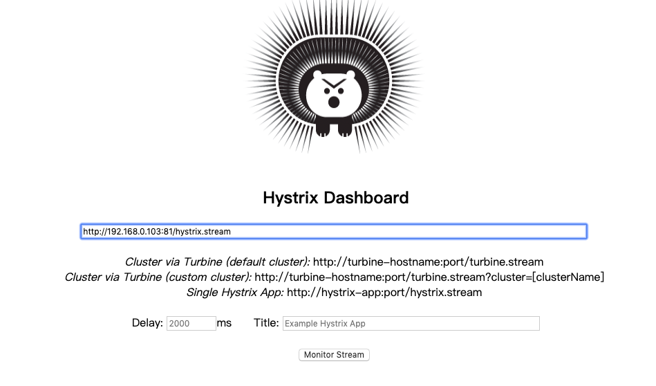
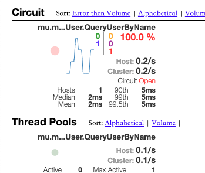

# 第六章 熔断、降级、容错与健康检查

分布式系统中，随时随地都可能会出现异常,我们需要尽可能地提高系统容错能力。容错，字面意思就是可以容下错误，不让错误再次扩张，让这个错误产生的影响在一定范围之内。我们常见的降级，限流，熔断器，超时重试等等都是容错的方法。服务降级通常指业务上的降级，比如淘宝双十一为了承受巨大的流量会暂时关闭退款功能。当然熔断也是属于服务降级的一种策略，当一个服务出现了故障，直接熔断这个服务，而不是等待调用超时。

## 熔断

我们将使用Hystrix来演示熔断在micro的使用方法。Hystrix的golang的[实现库](https://github.com/afex/hystrix-go):

```Bash
go get github.com/afex/hystrix-go
```

### 如何使用Hystrix

使用Hystrix我们需要根据具体情况配置一些参数，才能达到使用效果。

```go
// DefaultTimeout is how long to wait for command to complete, in milliseconds
DefaultTimeout = 1000
// DefaultMaxConcurrent is how many commands of the same type can run at the same time
DefaultMaxConcurrent = 10
// DefaultVolumeThreshold is the minimum number of requests needed before a circuit can be tripped due to health
DefaultVolumeThreshold = 20
// DefaultSleepWindow is how long, in milliseconds, to wait after a circuit opens before testing for recovery
DefaultSleepWindow = 5000
// DefaultErrorPercentThreshold causes circuits to open once the rolling measure of errors exceeds this percent of requests
DefaultErrorPercentThreshold = 50
```

VolumeThreshold就是单位时间内(10s)触发熔断的最低请求次数，默认为20。ErrorPercentThreshold即触发熔断要达到的错误率，默认为50%。总结一下，即在单位时间内如果调用次数超过20次，且错误率超过50%就触发熔断。

熔断打开之后，再有请求调用的时候，将不会调用主逻辑，而是直接调用降级逻辑。这个时候就会快速返回，而不是等超时后才返回。

在熔断器打开之后，Hystrix会启动一个休眠时间窗SleepWindow，默认为5s。当休眠时间窗到期，熔断器就进入半开状态，允许一次请求到原来的主逻辑上。如果此次请求正常返回，那么熔断器将会关闭，主逻辑恢复正常。否则，熔断器继续保持打开状态，而休眠时间窗会重新计时。

关于Hystrix的详细实现原理，可以查看官方[wiki](https://github.com/Netflix/Hystrix/wiki)。

Hystrix其实就是包装客户端的RPC调用，在这个包装层里实现熔断策略。hystrix-go提供同步和异步两种方式来包装RPC调用。在**go-plugins/wrapper/breaker/hystrix**中micro已有一个现成插件：

```go
package hystrix

import (
	"github.com/afex/hystrix-go/hystrix"
	"github.com/micro/go-micro/client"

	"context"
)

type clientWrapper struct {
	client.Client
}

func (c *clientWrapper) Call(ctx context.Context, req client.Request, rsp interface{}, opts ...client.CallOption) error {
	return hystrix.Do(req.Service()+"."+req.Endpoint(), func() error {
		return c.Client.Call(ctx, req, rsp, opts...)
	}, nil)
}

// NewClientWrapper returns a hystrix client Wrapper.
func NewClientWrapper() client.Wrapper {
	return func(c client.Client) client.Client {
		return &clientWrapper{c}
	}
}
```

其中，**hystrix.Do**方法传入的第三个参数是nil,我们来看看方法的声明

```go
type fallbackFunc func(error) error
...
func Do(name string, run runFunc, fallback fallbackFunc)
```

第三个参数fallback传入一个函数，当主逻辑run方法执行失败或者熔断器触发了，就会执行fallback函数。

修改每个web服务handler包的Init方法，为客户端增加Hystrix插件

```go
import (
...
	"github.com/micro/go-plugins/wrapper/breaker/hystrix"
...
)

func Init() {
	hystrix_go.DefaultVolumeThreshold = 1
	hystrix_go.DefaultErrorPercentThreshold = 1
	cl :=  hystrix.NewClientWrapper()(client.DefaultClient)
	serviceClient = us.NewUserService("mu.micro.book.srv.user", cl)
	authClient = auth.NewService("mu.micro.book.srv.auth", cl)
}
	)
...
}
```

为了方便演示熔断器打开的情况，我们将hystrix的最低请求次数设为1，最低错误率也设为1。

### 演示

1. 按照教程三演示部分将所有服务启动，除了user-srv (为了演示调用失败触发熔断器的情况)。
2. 按照教程三演示部分在 postman 连续执行两次 POST http://127.0.0.1:8080/user/login

第一次执行，会返回状态码500，消息如下：

```
{"id":"go.micro.client","code":500,"detail":"error selecting mu.micro.book.srv.user node: not found","status":"Internal Server Error"}
```

第二次执行，此时熔断器打开。返回状态码500，消息如下：

```
hystrix: circuit open
```

### 扩展

我们可以通过 hystrix-dashboard 将熔断器状态可视化。
在 user-web 的main函数中添加如下代码，启动一个HTTP服务为hystrix-dashboard提供数据：

```go
hystrixStreamHandler := hystrix.NewStreamHandler()
hystrixStreamHandler.Start()
go http.ListenAndServe(net.JoinHostPort("", "81"), hystrixStreamHandler)
```

容器启动hystrix-dashboard，然后浏览器打开 http://127.0.0.1:8081/hystrix.stream

```
docker run --name hystrix-dashboard -d -p 8081:9002 mlabouardy/hystrix-dashboard:latest
```

输入 http://{ip}:81/hystrix.stream , 点击最下方按钮。此处ip为本机ip，因为hystrix-dashboard是容器启动的，无法直接访问本机127.0.0.1


当熔断器触发，我们可以看到UI显示 Circuit Open


由于hystrix-dashboard只可以接受一个服务的hystrix.stream，所以当我们有多个服务需要被监控并展示在hystrix-dashboard上时，还需要turbine来做信息聚集。本章节对此不做详细讲解，感兴趣的同学可以上网查询相关资料。

## 降级

降级，可以是出于别的目的人为暂停某个服务。也可以是当某个服务熔断之后，自动降级转而执行预定的备用逻辑。我们演示一下使用hystrix实现自动降级执行备用逻辑的方法。

假设登陆服务因为内部某些服务挂了，无法正常工作触发了熔断器，我们不应该直接将内部错误返回给客户端，而是以更友好的方式引导用户等待服务恢复。

```go
package breaker

import (
	"errors"
	"fmt"
	"net/http"

	status_code "github.com/micro-in-cn/tutorials/microservice-in-micro/part6/plugins/breaker/http"
	"github.com/afex/hystrix-go/hystrix"
)

//BreakerWrapper hystrix breaker
func BreakerWrapper(h http.Handler) http.Handler {
	return http.HandlerFunc(func(w http.ResponseWriter, r *http.Request) {
		name := r.Method + "-" + r.RequestURI
		hystrix.Do(name, func() error {
			sct := &status_code.StatusCodeTracker{ResponseWriter: w, Status: http.StatusOK}
			h.ServeHTTP(sct.WrappedResponseWriter(), r)

			if sct.Status >= http.StatusInternalServerError {
				str := fmt.Sprintf("status code %d", sct.Status)
				return errors.New(str)
			}
			return nil
		}, func(e error) error {
			if e == hystrix.ErrCircuitOpen {
				w.WriteHeader(http.StatusAccepted)
				w.Write([]byte("请稍后重试"))
			}

			return e
		})
	})
}

func main() {
...
// 注册登录接口
	handlerLogin := http.HandlerFunc(handler.Login)
	service.Handle("/user/login", breaker.BreakerWrapper(handlerLogin))
...
}
```

我们使用hystrix实现一个Wrapper来包装登陆handler。当登陆服务无法正常工作触发熔断器打开时，返回我们预定义的消息，提示用户等待。

## 重试
 
在分布式系统中，经常会有服务出现故障，所以良好的重试机制可以大大的提高系统的容错性，可用性。下面主要分析micro的客户端重试机制，以及micro中如何设置。
 
### micro 重试实现
 micro框架提供方法设置客户端重试的次数。
 
```go
Client.Init(
	client.Retries(3),
)
```

当client请求失败时，客户端会根据selector的策略选择下一个节点重试请求。这样当一个服务实例故障时，客户端可以自动调用另一个实例。

我们来看看micro 客户端内部重试的实现：
> go-micro\client\rpc_client.go

```go
func (r *rpcClient) Call(ctx context.Context, request Request, response interface{}, opts ...CallOption) error {
...
    //客户端call 调用函数， 在下面的循环中调用
	call := func(i int) error {
		// call backoff first. Someone may want an initial start delay
		t, err := callOpts.Backoff(ctx, request, i)
		if err != nil {
			return errors.InternalServerError("go.micro.client", "backoff error: %v", err.Error())
		}

		// only sleep if greater than 0
		if t.Seconds() > 0 {
			time.Sleep(t)
		}

		// 根据selector策略 选出 下一个节点
		node, err := next()
		if err != nil && err == selector.ErrNotFound {
			return errors.NotFound("go.micro.client", "service %s: %v", request.Service(), err.Error())
		} else if err != nil {
			return errors.InternalServerError("go.micro.client", "error getting next %s node: %v", request.Service(), err.Error())
		}

		// 客户端调用
		err = rcall(ctx, node, request, response, callOpts)
		r.opts.Selector.Mark(request.Service(), node, err)
		return err
	}

	ch := make(chan error, callOpts.Retries+1)
	var gerr error
    //根据设定的**Retries**（重试次数）循环调用 call，如果执行成功，调用超时或者设置的**Retry**函数执行出错则直接退出，不继续重试
	for i := 0; i <= callOpts.Retries; i++ {
		go func(i int) {
			ch <- call(i)
		}(i)

		select {
		case <-ctx.Done(): //超时
			return errors.Timeout("go.micro.client", fmt.Sprintf("call timeout: %v", ctx.Err()))
		case err := <-ch:
			// if the call succeeded lets bail early
			if err == nil {  //调用成功
				return nil
			}

			retry, rerr := callOpts.Retry(ctx, request, i, err)
			if rerr != nil {
				return rerr
			}

			if !retry {
				return err
			}

			gerr = err
		}
	}

	return gerr
}
```

micro将选举下一个节点，RPC调用封装到一个匿名函数中，然后根据设定的重试次数循环调用。如果调用成功或者超时则直接返回，不继续重试。其中，当**callOpts**里设定的**Retry**函数执行失败，即第一个返回值为false，或者第二个返回值为err不会nil时，也会退出循环直接返回。

我们来看下Retry是什么：

```go
type CallOptions struct {
	Retry RetryFunc
}
```

client的CallOptions中定义了Retry，我们跳转到RetryFunc
> go-micro\client\retry.go

```go
// note that returning either false or a non-nil error will result in the call not being retried
type RetryFunc func(ctx context.Context, req Request, retryCount int, err error) (bool, error)

// RetryAlways always retry on error
func RetryAlways(ctx context.Context, req Request, retryCount int, err error) (bool, error) {
	return true, nil
}

// RetryOnError retries a request on a 500 or timeout error
func RetryOnError(ctx context.Context, req Request, retryCount int, err error) (bool, error) {
	if err == nil {
		return false, nil
	}

	e := errors.Parse(err.Error())
	if e == nil {
		return false, nil
	}

	switch e.Code {
	// retry on timeout or internal server error
	case 408, 500:
		return true, nil
	default:
		return false, nil
	}
}
```

从中我们可以发现，作者预实现了两个**Retry**函数：**RetryAlways**、**RetryOnError**。
**RetryAlways**直接返回**true, nil**，即不退出重试。
**RetryOnError**只有当e.Code（上一次RPC调用结果）为408或者500时才会返回**true, nil**，继续重试。
micro的默认**Retry**为**RetryOnError**，但是我们可以自定义并设置，下面的实验中将会演示。

```go
	DefaultRetry = RetryOnError
	// DefaultRetries is the default number of times a request is tried
	DefaultRetries = 1
	// DefaultRequestTimeout is the default request timeout
	DefaultRequestTimeout = time.Second * 5
```

### 设置

我们修改**orders-web**下的服务，在handler的**Init**函数中设置客户端重试。

```go
func Init() {
	hystrix_go.DefaultVolumeThreshold = 1
	hystrix_go.DefaultErrorPercentThreshold = 1
	cl := hystrix.NewClientWrapper()(client.DefaultClient)
	cl.Init(
		client.Retries(3),
		//为了调试看log方便，始终返回true, nil，即会一直重试直至重试次数用尽
		client.Retry(func(ctx context.Context, req client.Request, retryCount int, err error) (bool, error) {
			log.Log(req.Method(), retryCount, " client retry")
			return true, nil
		}),
	)
	serviceClient = orders.NewOrdersService("mu.micro.book.srv.orders", cl)
	authClient = auth.NewService("mu.micro.book.srv.auth", cl)
}
```

当客户端请求另一个服务时，如果被请求的服务突然挂了，此时客户端尚未感知依旧会去请求，重试时客户端会请求另一个实例（有一定几率还会请求同一个实例，因为默认的selector策略是哈希随机）。

## 健康检查

在微服务架构中，每个服务都会存在多个实例，可能部署在不同的主机中。因为有网络或者主机等不确定因素，所以每个服务都可能会出现故障。我们需要能够掌握每个服务实例的健康状态，当一个服务故障时，及时将它从注册中心删除。

micro服务注册功能提供的两个参数来实现健康检查功能：

```
micro.RegisterTTL(time.Second*30)
micro.RegisterInterval(time.Second*20)
```

Interval就是间隔多久服务会自动重新注册，TTL就是注册服务的过期时间，如果服务超过过期时间没有去重新注册，注册中心会将其删除。

其实现在**go-micro/server/rpc_server.go**中,micro使用一个定时器按照设定的间隔时间去自动重新注册。当服务意外故障，无法向注册中心重新注册时，如果超过了设定的TTL时间，注册中心就会将服务删除。


修改每个服务的main函数，增加两行代码，srv服务如下：

```
...
// 新建服务
	service := micro.NewService(
		micro.Name("mu.micro.book.srv.user"),
+		micro.RegisterTTL(time.Second*15),
+		micro.RegisterInterval(time.Second*10),
		micro.Registry(micReg),
		micro.Version("latest"),
	)
...
```

web服务如下：

```
...
	// 创建新服务
	service := web.NewService(
		web.Name(cfg.Name),
		web.Version(cfg.Version),
+		web.RegisterTTL(time.Second*15),
+		web.RegisterInterval(time.Second*10),
		web.Registry(micReg),
		web.Address(cfg.Addr()),
	)
...
```

### 演示

1. 启动user-web服务
2. kill -9 {user-web PID}

> 我们不能直接用 **control + C** 快捷键来杀死进程，因为micro内部捕获这个信号，并且主动去注册中心注销然后退出进程

kill 进程后，我们可以在etcd的UI看到，etcd的健康检查已经出现提示，但是服务还没有删除。


等待TTL超时后，我们可以看到etcd已经将服务删除。


## 总结

本章我们主要简单介绍了在micro中使用hystrix来实现熔断，降级提高系统容错性能的方法，以及micro中服务的健康检查原理和客户端重试机制。


[下一篇][第七章]我们会讲解在micro中如何实现分布式链路追踪。

## 参考阅读

[Hystrix Wiki](https://github.com/Netflix/Hystrix/wiki)

## 系列文章

- [第一章 用户服务][第一章]
- [第二章 权限服务][第二章]
- [第三章 库存服务、订单服务、支付服务与Session管理][第三章]
- [第四章 使用配置中心][第四章]
- [第五章 日志持久化][第五章]
- [第七章 链路追踪][第七章]
- [第八章 容器化][第八章]

[第一章]: ../part1
[第二章]: ../part2
[第三章]: ../part3
[第四章]: ../part4
[第五章]: ../part5
[第七章]: ../part7
[第八章]: ../part8
