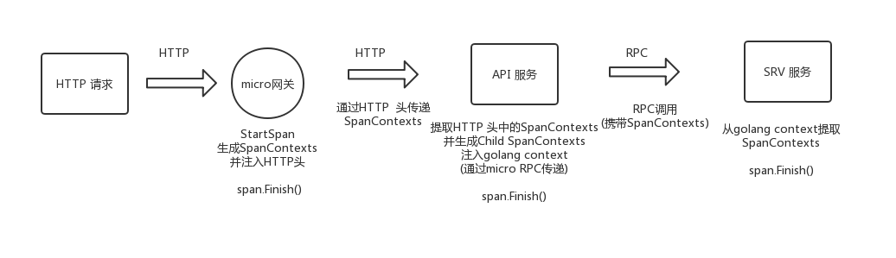
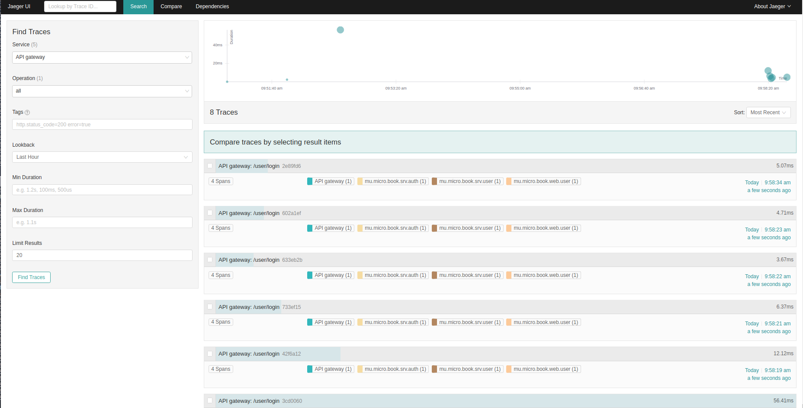
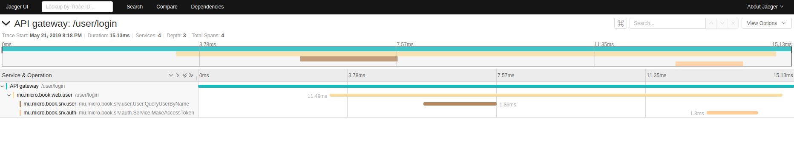

# 第七章 链路追踪

微服务系统中，客户端的一次请求，可能需要经过系统中多个模块的相互协作才能完成。为了追踪客户端的一次操作背后调用了哪些模块以及调用先后顺序，我们需要一个分布式链路追踪系统。我们选择 Jaeger，Jaeger 是 Uber 推出的一款开源分布式追踪系统，兼容 OpenTracing API。

OpenTracing 通过提供平台无关、厂商无关的API，使得开发人员能够方便的添加（或更换）追踪系统的实现。 OpenTracing 提供了用于运营支撑系统的和针对特定平台的辅助程序库，所以我们使用 OpenTracing 的程序库可以方便的替换追踪工具。 

## 部署Jaeger实验环境

Jaeger 提供一个all in one 的docker镜像，可以快速搭建实验环境

```bash
docker run -d --name jaeger 
-e COLLECTOR_ZIPKIN_HTTP_PORT=9411 
-p 5775:5775/udp 
-p 6831:6831/udp 
-p 6832:6832/udp 
-p 5778:5778 
-p 16686:16686 
-p 14268:14268 
-p 9411:9411 
jaegertracing/all-in-one:1.6
```

然后，打开  http://localhost:16686 进入 Jaeger 的 UI

## micro链路追踪插件

> 关于 opentracing 相关的内容本文不会介绍，仅仅介绍在micro中如何接入使用，不了解 opentracing 的同学建议先自行查阅相关资料了解。



外部HTTP请求首先经过API网关，网关生成第一个SpanContexts并且通过HTTP头传递到聚合层的API服务，这边需要我们自己实现一个插件去做这件事，原理很简单，拦截每一次请求添加信息就可以了。

查看micro自带的opentracing插件，可以发现是通过golang的context传递，micro的RPC已经封装好了通过context在跨进程服务间传递SpanContexts机制，所以我们还需要在API服务层(web 服务)实现一个插件，从HTTP头中取出SpanContexts并按照micro自带的方式注入golang context。

### srv 服务的opentracing插件

在micro自带的插件中已经有opentracing的插件了，包含server，client等，在 **micro/go-plugins/wrapper/trace/opentracing** 目录下，不过这个插件只能在go-micro构建的微服务(api，srv)中使用。

```go
// micro opentracing插件中wHandlerWrappe
// NewHandlerWrapper accepts an opentracing Tracer and returns a Handler Wrapper
func NewHandlerWrapper(ot opentracing.Tracer) server.HandlerWrapper {
    return func(h server.HandlerFunc) server.HandlerFunc {
        return func(ctx context.Context, req server.Request, rsp interface{}) error {
            name := fmt.Sprintf("%s.%s", req.Service(), req.Endpoint())
            ctx, span, err := traceIntoContext(ctx, ot, name)
            if err != nil {
                return err
            }
            defer span.Finish()
            return h(ctx, req, rsp)
        }
    }
}
```

我们可以在构建服务的时候直接使用，只需要在服务初始化时增加一行函数就可以了。

```go
 service := micro.NewService(
         micro.Name(name),
         micro.Version("latest"),
+        micro.WrapHandler(opentracing.NewHandlerWrapper(opentracing.GlobalTracer())),
    )
```

我们修改 user-srv 等其他 srv 服务，在 NewService 时增加如上一行代码即可。

### micro API 网关opentracing插件

micro API 网关opentracing插件的作用就是生成 SpanContexts 并且通过HTTP头传递，实现也非常简单

```go
// TracerWrapper tracer wrapper
func TracerWrapper(h http.Handler) http.Handler {
	return http.HandlerFunc(func(w http.ResponseWriter, r *http.Request) {
		spanCtx, _ := opentracing.GlobalTracer().Extract(opentracing.HTTPHeaders, opentracing.HTTPHeadersCarrier(r.Header))
		sp := opentracing.GlobalTracer().StartSpan(r.URL.Path, opentracing.ChildOf(spanCtx))
		defer sp.Finish()

		if err := opentracing.GlobalTracer().Inject(
			sp.Context(),
			opentracing.HTTPHeaders,
			opentracing.HTTPHeadersCarrier(r.Header)); err != nil {
			log.Println(err)
		}

		sct := &status_code.StatusCodeTracker{ResponseWriter: w, Status: http.StatusOK}
		h.ServeHTTP(sct.WrappedResponseWriter(), r)

		ext.HTTPMethod.Set(sp, r.Method)
		ext.HTTPUrl.Set(sp, r.URL.EscapedPath())
		ext.HTTPStatusCode.Set(sp, uint16(sct.Status))
		if sct.Status >= http.StatusInternalServerError {
			ext.Error.Set(sp, true)
		}
	})
}
```

我在另一个仓库中，已有现成的实现，包括 API 网关和插件库。本项目中会直接引用： [仓库地址](https://github.com/Allenxuxu/microservices)

我们将相关插件复制到 plugins 目录下，将 API 网关 复制到 micro 目录下。

micro 目录中是注册各类插件的 micro API 网关，我们将其他本次实验中不需要的插件删除掉并修改头文件。

```go
package main

import (
	"log"

	tracer "github.com/micro-in-cn/tutorials/microservice-in-micro/part7/plugins/tracer/jaeger"
	"github.com/micro-in-cn/tutorials/microservice-in-micro/part7/plugins/tracer/opentracing/stdhttp"
	
	"github.com/micro/go-plugins/micro/cors"
	"github.com/micro/micro/cmd"
	"github.com/micro/micro/plugin"
	opentracing "github.com/opentracing/opentracing-go"
)

func init() {
	plugin.Register(cors.NewPlugin())

	plugin.Register(plugin.NewPlugin(
		plugin.WithName("tracer"),
		plugin.WithHandler(
			stdhttp.TracerWrapper,
		),
	))
}

const name = "API gateway"

func main() {
	t, io, err := tracer.NewTracer(name, "")
	if err != nil {
		log.Fatal(err)
	}
	defer io.Close()
	opentracing.SetGlobalTracer(t)

	cmd.Init()
}
```

然后启动网关：

```bash
$  go run main.go --registry=consul --api_namespace=mu.micro.book.web  api --handler=web
```

### web/api 服务opentracing插件

对于 user-web orders-web payment-web 这类服务主要职责是接收 API 网关转发过来的HTTP请求并通过RPC调用相关的服务完成业务逻辑。所以此类服务的 opentracing 插件，就是要将 API 网关中注入HTTP头中的 SpanContexts 取出并注入 http.Request context。 在使用RPC调用时，传递此 context，这样下游被调用服务可以从 context 中取出 SpanContexts。 

```go
// TracerWrapper tracer wrapper
func TracerWrapper(h http.Handler) http.Handler {
	return http.HandlerFunc(func(w http.ResponseWriter, r *http.Request) {
		md := make(map[string]string)
		spanCtx, _ := opentracing.GlobalTracer().Extract(opentracing.HTTPHeaders, opentracing.HTTPHeadersCarrier(r.Header))
		sp := opentracing.GlobalTracer().StartSpan(r.URL.Path, opentracing.ChildOf(spanCtx))
		defer sp.Finish()

		if err := opentracing.GlobalTracer().Inject(
			sp.Context(),
			opentracing.TextMap,
			opentracing.TextMapCarrier(md)); err != nil {
			log.Println(err)
		}

		ctx := context.TODO()
		ctx = opentracing.ContextWithSpan(ctx, sp)
		ctx = metadata.NewContext(ctx, md)
		r = r.WithContext(ctx)

		sct := &status_code.StatusCodeTracker{ResponseWriter: w, Status: http.StatusOK}
		h.ServeHTTP(sct.WrappedResponseWriter(), r)

		ext.HTTPMethod.Set(sp, r.Method)
		ext.HTTPUrl.Set(sp, r.URL.EscapedPath())
		ext.HTTPStatusCode.Set(sp, uint16(sct.Status))
		if sct.Status >= http.StatusInternalServerError {
			ext.Error.Set(sp, true)
		}
	})
}
```

我们以 user-web 为例来修改服务代码，主要修改两个地方： main 函数中注册 tracer 并且为 HTTP handler 增加我们的插件， handler目录handler.go中在每一个 handler 函数里取出 http.Request 里我们之前注入的 context 并在执行 RPC 调用时传入。

```go
package main

import (
	"github.com/micro-in-cn/tutorials/microservice-in-micro/part7/plugins/tracer/opentracing/std2micro"
	"fmt"
	"net"
	"net/http"
	"time"

	"github.com/micro-in-cn/tutorials/microservice-in-micro/part7/plugins/breaker"
	tracer "github.com/micro-in-cn/tutorials/microservice-in-micro/part7/plugins/tracer/jaeger"
	opentracing "github.com/opentracing/opentracing-go"

	"github.com/afex/hystrix-go/hystrix"
	"github.com/micro-in-cn/tutorials/microservice-in-micro/part7/basic"
	"github.com/micro-in-cn/tutorials/microservice-in-micro/part7/basic/common"
	"github.com/micro-in-cn/tutorials/microservice-in-micro/part7/basic/config"
	"github.com/micro-in-cn/tutorials/microservice-in-micro/part7/user-web/handler"
	"github.com/micro/cli"
	"github.com/micro/go-config/source/grpc"
	"github.com/micro/go-log"
	"github.com/micro/go-micro/registry"
	"github.com/micro/go-micro/registry/consul"
	"github.com/micro/go-web"
)

var (
	appName = "user_web"
	cfg     = &userCfg{}
)

type userCfg struct {
	common.AppCfg
}

func main() {
	// 初始化配置
	initCfg()

	// 使用consul注册
	micReg := consul.NewRegistry(registryOptions)

+	t, io, err := tracer.NewTracer(cfg.Name, "")
+	if err != nil {
+		log.Fatal(err)
+	}
+	defer io.Close()
+	opentracing.SetGlobalTracer(t)

	// 创建新服务
	service := web.NewService(
		web.Name(cfg.Name),
		web.Version(cfg.Version),
		web.RegisterTTL(time.Second*15),
		web.RegisterInterval(time.Second*10),
		web.Registry(micReg),
		web.Address(cfg.Addr()),
	)

	// 初始化服务
	if err := service.Init(
		web.Action(
			func(c *cli.Context) {
				// 初始化handler
				handler.Init()
			}),
	); err != nil {
		log.Fatal(err)
	}

	// 注册登录接口
	handlerLogin := http.HandlerFunc(handler.Login)
+	service.Handle("/user/login", std2micro.TracerWrapper(breaker.BreakerWrapper(handlerLogin)))
	// 注册退出接口
+	service.Handle("/user/logout", std2micro.TracerWrapper(http.HandlerFunc(handler.Logout)))
+	service.Handle("/user/test", std2micro.TracerWrapper(http.HandlerFunc(handler.TestSession)))

	hystrixStreamHandler := hystrix.NewStreamHandler()
	hystrixStreamHandler.Start()
	go http.ListenAndServe(net.JoinHostPort("", "81"), hystrixStreamHandler)

	// 运行服务
	if err := service.Run(); err != nil {
		log.Fatal(err)
	}
}

...
```

```go
...

// Login 登录入口
func Login(w http.ResponseWriter, r *http.Request) {
+	ctx := r.Context()

	// 只接受POST请求
	if r.Method != "POST" {
		log.Logf("非法请求")
		http.Error(w, "非法请求", 400)
		return
	}

	r.ParseForm()

	// 调用后台服务
+	rsp, err := serviceClient.QueryUserByName(ctx, &us.Request{
		UserName: r.Form.Get("userName"),
	})
	if err != nil {
		http.Error(w, err.Error(), 500)
		return
	}

...
```

### 采样率
在生产环境中追踪系统不能影响到核心业务的性能，所以要进行采样，每个应用和服务可以自己设置采样率。采样率应该是在每个应用自己的配置里设置的，这样可以动态调节每个服务，对于刚上线的服务应该采样率调高一点。

我们修改 TracerWrapper 插件, 增加一个简单的采样率设置功能。主要原理就是，设定采样率 n (百分之n， 0 <= n <= 100), 随机生成0～100的整数x， 如果 x < n, 则采样。但是，如果调用返回出错，则直接采样。

opentracng 库提供 SamplingPriority 供设置，当设置为 0 时，即本次不采样，我们通过此方法来控制采样与否。

```go
// sf sampling frequency
var sf = 100

func init() {
	rand.Seed(time.Now().Unix())
}

// SetSamplingFrequency 设置采样频率
// 0 <= n <= 100
func SetSamplingFrequency(n int) {
	sf = n
}

// TracerWrapper tracer wrapper
func TracerWrapper(h http.Handler) http.Handler {
	return http.HandlerFunc(func(w http.ResponseWriter, r *http.Request) {
		spanCtx, _ := opentracing.GlobalTracer().Extract(opentracing.HTTPHeaders, opentracing.HTTPHeadersCarrier(r.Header))
		sp := opentracing.GlobalTracer().StartSpan(r.URL.Path, opentracing.ChildOf(spanCtx))
		defer sp.Finish()

		if err := opentracing.GlobalTracer().Inject(
			sp.Context(),
			opentracing.HTTPHeaders,
			opentracing.HTTPHeadersCarrier(r.Header)); err != nil {
			log.Println(err)
		}

		sct := &status_code.StatusCodeTracker{ResponseWriter: w, Status: http.StatusOK}
		h.ServeHTTP(sct.WrappedResponseWriter(), r)

		ext.HTTPMethod.Set(sp, r.Method)
		ext.HTTPUrl.Set(sp, r.URL.EscapedPath())
		ext.HTTPStatusCode.Set(sp, uint16(sct.Status))
		if sct.Status >= http.StatusInternalServerError {
			ext.Error.Set(sp, true)
		} else if rand.Intn(100) > sf {
			ext.SamplingPriority.Set(sp, 0)
		}
	})
}
```

默认的采样率为 100%，需要设置采样率 只需要调用相应的**SetSamplingFrequency**方法设置即可。

以 user_web 服务为例，只需要在main函数中，增加一行代码：

```go
...

+	//设置采样率
+	std2micro.SetSamplingFrequency(50)
	// 注册登录接口
	handlerLogin := http.HandlerFunc(handler.Login)
	service.Handle("/user/login", std2micro.TracerWrapper(breaker.BreakerWrapper(handlerLogin)))
	// 注册退出接口
	service.Handle("/user/logout", std2micro.TracerWrapper(http.HandlerFunc(handler.Logout)))
	service.Handle("/user/test", std2micro.TracerWrapper(http.HandlerFunc(handler.TestSession)))

...
```

## 实验

按文首 部署Jaeger实验环境 环境搭建并打开 http://localhost:16686

启动 修改后的 API 网关

```
$  cd $GOPATH/src/github.com/Allenxuxu/microservices/micro/
$  make && ../build/microGW --registry=consul --api_namespace=mu.micro.book.web  api --handler=web
```

启动 **config-grpc-srv**

```bash
$ cd config-grpc-srv
$ go run main.go
```

启动 **auth**

```bash
$ cd auth
$ go run main.go plugin.go
```

启动 **user-web**

```bash
$ cd user-web
$ go run main.go plugin.go
```

启动 **user-srv**

```bash
$ cd user-srv
$ go run main.go plugin.go
```

导入 postman_collection.json 到 postman 中并且 POST http://127.0.0.1:8080/user/login

然后，在 jaeger UI 中可以查看到调用链





## 总结

本文主要介绍了如何在micro中实现从 API 网关到最底层 srv 服务的调用链路监控，但是限于篇幅并未介绍 Jaeger 和 opentracing 相关知识，需要同学们自行查阅相关资料。

## 参考阅读

[分布式集群环境下调用链路追踪](https://www.ibm.com/developerworks/cn/web/wa-distributed-systems-request-tracing/index.html)

[OpenTracing中文文档](https://wu-sheng.gitbooks.io/opentracing-io/content/)

[jaeger分布式链路追踪](https://blog.mogutou.xyz/blog/post/xuxu/%E3%80%90GO-Micro%E3%80%91jaegerlian-lu)

## 系列文章

- [第一章 用户服务][第一章]
- [第二章 权限服务][第二章]
- [第三章 库存服务、订单服务、支付服务与Session管理][第三章]
- [第四章 使用配置中心][第四章]
- [第五章 日志持久化][第五章]
- [第六章 熔断、降级、容错与健康检查][第六章]
- [第八章 容器化][第八章] doing
- [第九章 总结][第九章] todo

[第一章]: ../part1
[第二章]: ../part2
[第三章]: ../part3
[第四章]: ../part4
[第五章]: ../part5
[第六章]: ../part6
[第七章]: ../part7
[第八章]: ../part8
[第九章]: ../part9