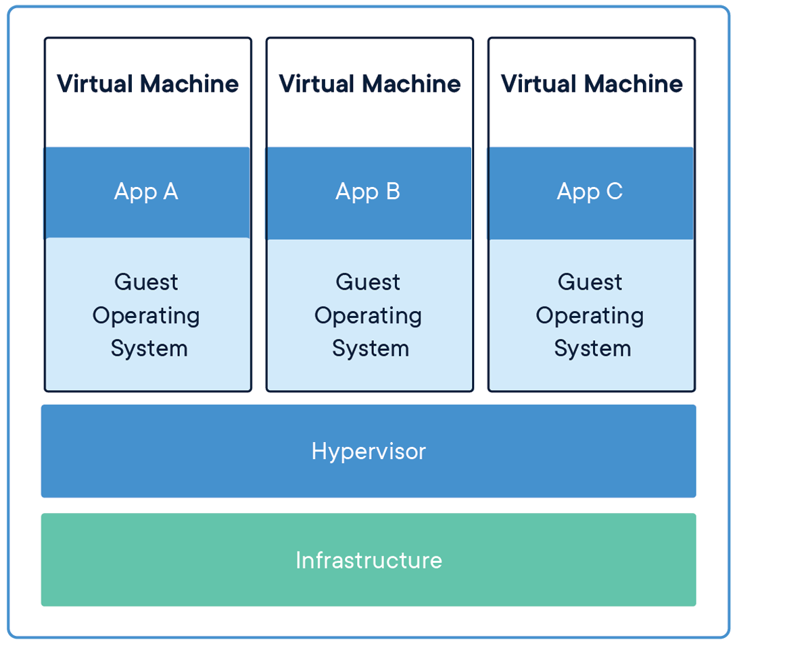

# 容器化 (in progress)

容器化是直把服务部署在容器之中，它与传统在服务器上直接部署应用的方式不同。

容器可以帮助我们可以快速发布业务软件系统。它将业务软件系统封装在一个最小化的独立操作系统中（minimum system)，就好像只有这个软件在一台独立的主机上运行一样。

## 什么是容器

容器是一个业务软件系统打包在一起的单元结构。容器可以在任何操作系统中发布，可以快速、可靠从旧环境迁移到另一个操作系统环境。比如Docker容器（引擎），在其之上运行镜像，便可以在镜像之中运行所有可执行程序。

容器单元彼此之间互相隔离，互不干扰。它不受运行和开发环境的影响。

### 为什么要什么容器？

接下来可能有朋友会问，为什么不用VMware、VirtualBox或者其它已经非常成熟虚拟化技术。我们引用[Docker](https://www.docker.com/resources/what-container)上的结构图说明：

容器             |  虚拟机
:-------------------------:|:-------------------------:
  |  

虚拟机采用的是硬件级别的**系统级**虚拟化方案，需要CPU等硬件支持，而容器则是在虚拟机之上的更高级别的**进程级**虚拟化技术。

可见，容器依赖虚拟机但是比虚拟机虚拟出的系统更轻量，因为它并非为了派生操作系统，而是为了精简系统、复用虚拟机技术并在其之上运行软件。

启动时间             | 启动时间             |  停止时间
:-------------------------|:-------------------------:|:-------------------------:
容器（Docker）    | < 50 ms| < 50 ms
虚拟机 | 30-45 sec| 5-10 sec

[引伸阅读][Docker内部原理]

### Dockerfile

前面我们稍稍提到过镜像，镜像就好比一个程序的安装包，而这个安装包只能运行在Docker容器中，但与安装包不同的是，镜像自包含了独立的运行基础环境。

该基础环境便是镜像分层结构中的第一**层**，每个Docker镜像都通过一个叫作Dockerfile的文本文件描述。而Dockerfile则由**层**（**layer**）组成：

Dockerfile

```text
FROM ubuntu:18.04
COPY . /app
RUN make /app
CMD python /app/app.py
```

每一行就是一层，下一层基于上一层进行增量叠加。上面的示例中镜像文件所表达的意思大概是：

```text
1.基于ubuntu版本号18.04的系统运行程序
2.把当前目录复制到第1步中的系统中根目录下的app目录
3.在make编译app目录下的程序
4.执行脚本命令，通常是指运行脚本
```

我们再大概解释一下具体过程，Dockerfile需要声明一个基础镜像，该镜像在运行的时候就是一个操作系统（tiny linux)，我们为了能在该系统中运行服务，那么就需要把源码在这个系统中进行编译，所以就有了接下来的**COPY**与**RUN make**指令。编译好后就可以通过CMD命令执行脚本。

# 打包Go-Micro应用

接下来我们可以演示使用，在前面的章节中我们在使用**micro new**指令生成模板时，都会生成两个文件：Makefile与Dockerfile。

通常情况下，我们知道我们的服务要在哪种服务器中运行的，所以我们可以在实体机中使用Makefile打好包再把二进制文件搬到docker中，加上golang交叉编译的特性，我们更可以不用在Docker中去编译我们的代码，便可以直接运行。

我们用OrderSrv服务的Makefile演示：

Makefile

```makefile
GOPATH:=$(shell go env GOPATH)

.PHONY: build
build: proto
	GOOS=linux GOARCH=amd64 go build -o orders-srv main.go plugin.go

.PHONY: docker
docker:
	docker build . -t orders-srv:latest
```

.PHONY意思忽略与其后名称一样的文件，详情可见资料[.PHONY][.PHONY]，这里大家可以不用管它的作用。

在Makefile中我们声明了两个子命令build、docker

### 启动参数

我们知道**Go-Micro**应用可以通过命令行配置启动参数，那在docker中如何把这些参数传递过去呢。

1. **Env**

**Micro**提供了Env环境变量方式指定flag，所以我们可以基于该特性，在启动时设置docker实例。

```
docker run -e MICRO_REGISTRY_ADDRESS=192.168.13.2:8500 -i orders-srv
```

不过我们不会这么做，这样会把docker启动指令搞得又臭又长，我们把**Env**放到Dockerfile中：

```dockerfile
FROM alpine

ENV MICRO_REGISTRY_ADDRESS 192.168.13.2:8500
ENV MICRO_BOOK_CONFIG_GRPC_ADDR 192.168.13.2:9600

RUN apk update && apk add tzdata && cp -r -f /usr/share/zoneinfo/Asia/Shanghai /etc/localtime

ADD orders-srv /orders-srv

ENTRYPOINT [ "/orders-srv" ]
```

其中我们多加了个RUN指令，这是因为alpine镜像使用的是UTC时区，我们在+8区，故而我们需要设置一下时区，这样日志看起来顺眼些

> 其它传参的方式比如**CMD**、**ENTRYPOINT**大家可以自行研究，没有Env简单、方便、直观，我们不多赘述。

### 构建之前

因为我们把程序都放到容器这中运行，因此网络情况有所变化，故而需要把代码中部分写死的地址改成容器能访问到的地址，我们修改部分代码，使其变成可配置的地址。主要是配置中心的地址：

```golang
func initCfg() {
	configAddr := os.Getenv("MICRO_BOOK_CONFIG_GRPC_ADDR")
	source := grpc.NewSource(
		grpc.WithAddress(configAddr),
		grpc.WithPath("micro"),
	)
	
	// ...
}
```

我们将以前的**127.0.0.1:9600**改为使用环境变量的方式**os.Getenv("MICRO_BOOK_CONFIG_GRPC_ADDR")**。

### 打包

```bash
make build
make docker
```

然后我们可以查看刚打好包的镜像：

```bash
docker images 

REPOSITORY              TAG                 IMAGE ID            CREATED             SIZE
orders-srv              latest              4f4b6df3e32b        3 seconds ago       32.6MB
```

### 运行docker镜像实例

```bash
docker run --name orders-srv -d orders-srv 
```

## 总结

本小篇我们给大家演示使用docker打包我们的应用，我们用了这系列的8章给大家介绍如何使用Micro编写微服务，至此，本系列也已完结，不过，我们从始至终会一直坚持文档或教程也是项目的原则，写完后并不会将其搁置在一边，而是会随时保持与最新代码一致，不过，由于人力与精力有限，并不会实时保持最新，但是至少我们会让大家尽可能尽早吃到最香最新鲜的Micro！所以，未来本系列的章节结构也可能会有适当调整与丰富。

## 相关资料

[Docker内部原理][Docker内部原理]

[为什么使用Docker][为什么使用Docker]

[Docker的基础镜像比较](https://nickjanetakis.com/blog/the-3-biggest-wins-when-using-alpine-as-a-base-docker-image)

[理解Dockerfile](https://docs.docker.com/engine/reference/builder/)

[Docker内部原理]: https://medium.com/@nagarwal/understanding-the-docker-internals-7ccb052ce9fe
[为什么使用Docker]: https://runnable.com/docker/why-use-docker

[.PHONY]: https://stackoverflow.com/questions/2145590/what-is-the-purpose-of-phony-in-a-makefile